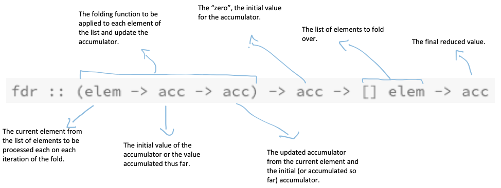

# Haskell Lists

## Mapping Over Lists

```
λ> map fst [(2, 3), (4, 5), (6, 7), (8, 9)]
[2,4,6,8]

λ> map (take 3) [[1..5], [1..5], [1..5]]
[[1,2,3],[1,2,3],[1,2,3]]
```

Map an if-then-else expressions with the help of a lambda. In this case, we negate any value 3 present in the list:

```
λ> map (\x -> if x == 3 then (- 3) else x) [1..5]
[1,2,-3,4,5]
```

```
λ> map minimum [[1..10], [10..20], [20..30]]
[1,10,20]

λ> map sum [[1..5], [1..5], [1..5]]
[15,15,15]
```

## Filtering

```
λ> filter (\v -> even v) [1..5]
[2,4]

λ> filter even [1..5]
[2,4]
```

```
λ> filter (\c -> elem c "aeiou") "Lara Croft - The Angel of Darkness"
"aaoeeoae"

λ> [c | c <- "Lara Croft - The Angel of Darkness", elem c "aeiou"]
"aaoeeoae"
```

## Zip

```
λ> zipWith (+) [1..3] [1..3]
[2,4,6]
```

```
λ> zipWith (\x y -> x + y + 10) [1..3] [4..6]
[15,17,19]

-- 1 + 4 + 10 = 15
-- 2 + 5 + 10 = 17
-- 3 + 6 + 10 = 19
```

## Folding Lists

“Where `map` applies a function to each member of a list and returns a list, a *fold* replaces the cons constructors with the function and reduces the list.

`sum [1..5]` is like mapping `(+)` over the list, replacing the cons, and returning a single result (instead of a list, which is what `map (+1)` would do:

```GHCi
λ> map (+1) [1..5]
[2,3,4,5,6]

λ> sum [1..5]
15
```

By “replacing the cons”, it means replacing with some other function:

```hs
sum :: [Integer] -> Integer
sum []     = 0
sum (x:xs) = x + sum xs
```

We replace the `:` cons with `+`. More examples:

```hs
length :: [a] -> Integer
length []     = 0
length (_:xs) = 1 + length xs

product :: [Integer] -> Integer
product []     = 1
product (x:xs) = x * product xs

concat :: [[a]] -> [a]
concat []   = []
concat (x:xs) = x ++ concat xs
```

The base case is always the identity for that function. Also, we replace the `:` cons with the appropriate function/operator for each case, `+` for addition, `*` for multiplication, and `++` for concatenating lists. Also, each has a recursive pattern that associates to the right. The recursion evaluates the head, then moves to the right to evaluate the next head recursively, until the list is fully consumed. All of these take a list and return a single result. They *reduce* the list to a single result.

### foldr

`foldr` is similar to `reduce` in JavaScript or `inject` in Ruby:

```HGCi
λ> foldr (\x acc -> x + acc) 0 [1..5]
15

λ> foldr (+) 0 [1..5]
15

λ> foldr (\x acc -> x + acc) 100 [1..5]
115

λ> foldr (+) 100 [1..5]
115
```

You pass a reducing function, the initial value for the accumulator, and the list of things to fold over.

Basic implementation:

```hs
myFoldr :: (a -> b -> b) -> b -> [a] -> b
myFoldr _ z [] = z
myFoldr f z (x:xs) = f x (myFoldr f z xs)
```

Note that the “rest of the fold” is `(myFoldr f z xs)`. `z` is the “zero” of the fold. It is the initial value, the fall back value for when the list is empty. We can also call it `acc`, short for *accumulator*, or `memo`, short for *memory* -- because it “remembers the thing computed thus far”. This “zero” value is often the identity for whatever function we are dealing with.

### foldr type signature

```
λ> :t foldr
foldr :: Foldable t => (a -> b -> b) -> b -> t a -> b
```

This alternative type signature could make it a little easier to understand:

```
fdr :: (elem -> acc -> acc) -> acc -> [] elem -> acc
fdr _ z []     = z
fdr f z (x:xs) = f x (fdr f z xs)
```

That is, `fdr` takes a function that takes an “element”, an the “accumulator”, and returns the updated accumulator. Then, it takes the initial value for the accumulator, a list of “elements” to fold over, and returns the final resulting value accumulated during the folding of the list.



### foldr evaluation

* [Fold - HaskellWiki](https://wiki.haskell.org/Fold)

We can use these helper functions to visualize how folding happens:

```hs
--
-- Helps visualize how foldr associates.
--
-- Usage:
--
--   debug (map show [1..5])
--
-- or
--
--   debug $ map show [1..5]
--
debugFoldrNums :: [Integer] -> String -> String
debugFoldrNums xs sep =
  foldr (\v acc -> concat
    ["(", v, sep, acc, ")"]) "0" listOfStrings
  where
    listOfStrings = map show xs

--
-- Helps visualizign association right.
--
-- Use it pretty much like you would use `foldr`, except the first two params
-- are string representations of the actual params you would use with `foldr`.
--
-- Example:
--
--   λ> dbgR " ^ " "1" [1..3]
--   "(1 ^ (2 ^ (3 ^ 1)))"
--
-- As you see, instead of
--
--   λ> foldr (^) 1 [1..3]
--
-- We replaced `(^)` with `" ^ "` and `1` with `"1"`.
--
-- You can use other operators like " + ", or " - " as well.
--
dbgR :: String -> String -> [Integer] -> String
dbgR op z xs =
  foldr (\v acc -> concat
    ["(", v, op, acc, ")"]) z listOfStrings
  where
    listOfStrings = map show xs

--
-- Helps visualizing association left.
--
-- Use it pretty much like you would use `foldl`, except the first two params
-- are string representations of the actual params you would use with `foldl`.
--
-- Example:
--
--   λ> dbgL " - " "0" [1..5]
--   "(((((0 - 1) - 2) - 3) - 4) - 5)"
--
-- As you see, instead of
--
--   λ> foldl (/) 1 [1..3]
--
-- We replaced `(-)` with `" - "` and `1` with `"1"`.
--
-- You can use other operators like " + ", or " / " as well.
--
dbgL :: String -> String -> [Integer] -> String
dbgL op z xs =
  foldl (\v acc -> concat
    ["(", v, op, acc, ")"]) z listOfStrings
  where
    listOfStrings = map show xs
```

### foldr addition example

Folding happens in two stages. First, there is the spine traversal to build up the expressions, replacing the cons with functions. Then, the actual folding takes place, which is the act of applying the folding or reducing function to the values.


```
λ> :t foldr
foldr :: Foldable t => (a -> b -> b) -> b -> t a -> b

foldr (+) 0 [1, 2, 3, 4]

foldr (+) 0 [1, 2, 3, 4]
(+) 1 (foldr (+) 0 [2, 3, 4])
(+) 1 ((+) 2 (foldr (+) 0 [3, 4]))
(+) 1 ((+) 2 ((+) 3 (foldr (+) 0 [4])))
(+) 1 ((+) 2 ((+) 3 ((+) 4 (foldr (+) 0 [])))) -- Zero comes last.
(+) 1 ((+) 2 ((+) 3 ((+) 4 0)))
(+) 1 ((+) 2 ((+) 3 4))
(+) 1 ((+) 2 7)
(+) 1 9
10

1 + (2 + (3 + (4 + 0))) -- Zero comes last.
1 + (2 + (3 + 4))
1 + (2 + 7)
1 + 9
10
```

Note how the zero, the initial accumulator comes last. Note the right-associativity of the folding. The parenthesis are *real*.

What if we start with an accumulator of 100 instead of zero?

```
foldr (+) 100 [1, 2, 3, 4]
1 + (2 + (3 + (4 + 100)))
1 + (2 + (3 + 104))
1 + (2 + 107)
1 + 109
110
```

Note how the cons `:` is replaced with the function `+`.

```
1 : (2 : (3 : (4 : [])))
1 + (2 + (3 + (4 + 0)))
1 + (2 + (3 + 4))
1 + (2 + 7)
1 + 9
10
```

### foldr subtraction example

```
foldr (-) 0 [1, 2, 3]
1 - (2 - (3 - 0))
1 - (2 - 3)
1 - (-1)
2 😱
```

`1 - (-1)` is `1 + 1` which is `2`. 😱

```
foldr (-) 100 [1, 2, 3]
1 - (2 - (3 - 100))
1 - (2 - (-97))
1 - 99
-98
```

One output was positive and the other negative.

### foldr any lambda

`||` is not strict on its right operand. If `f x` is `True`, it will not evaluate the `b` on the right of `||`. So, if `xs` is infinite but some application of `f x` is `True`, we do not hit bottom.

```
any :: (a -> Bool) -> [a] -> Bool
any f xs = foldr (\x b -> f x || b) False xs
```

`b` is `z`, the zero, the base case, the accumulator.

```
any even [1, 2, 3]
foldr (\x b -> even x || b) False [1, 3, 4]
even 1 || (foldr (\x b -> even x || b) False [3, 4])
even 1 || (even 3 || (foldr (\x b -> even x || b) False [4]))
even 1 || (even 3 || (even 4 || False))
even 1 || (even 3 || True)
even 1 || True
True

foldr (\x b -> even x || b) False [1, 3, 5]
even 1 || (foldr (\x b -> even x || b) False [3, 5])
even 1 || even 3 (foldr (\x b -> even x || b) False [5])
even 1 || (even 3 || (even 5 || False))
even 1 || (even 3 || False)
eve 1 || False
False
```

Even though `||` is *infixr*, evaluation needs to go up the call stack. It doesn't short circuit as soon as we have `True`.

If we run our `any` implementation above with an infinite of odd numbers, like `[1, 3..]`, then it would never stop. It would keep adding recursive invocations into the stack, forever, and that would be *bottom*. No problem if it is finite and we end up with the base/zero `False`, though.

### foldr lambda always 9

```
foldr (\_ _ -> 9) 0 [1, 2, 3]
(\_ _ -> 9) 1 (foldr (\_ _ -> 9) 0 [2, 3])
(\_ _ -> 9) 1 ((\_ _ -> 9) 2 (foldr (\_ _ -> 9) 0 [3]))
(\_ _ -> 9) 1 ((\_ _ -> 9) 2 ((\_ _ -> 9) 3 (foldr (\_ _ -> 9) 0 [])))
(\_ _ -> 9) 1 ((\_ _ -> 9) 2 ((\_ _ -> 9) 3 0))
(\_ _ -> 9) 1 9
9
```

### foldr const

`foldr` doesn't force the evaluation of “the rest of the fold”. `const`, although it requires two arguments in order to be fully applied, discards the second argument.

```
foldr const 0 [1, 2, 3]
const 1 (foldr const 0 [2, 3]
1
```

We are not passing 0 as the first argument to `const`. 0 is the zero, memo, or accumulator. With `foldr`, the accumulator is used last. The first value feed to `const` is 1 from the list.

`const` is applied to 1 and the “rest of the fold”, which is `(foldr const 0 [2, 3])`, except we never actually evaluate the rest of the fold and immediately return 1.

It works even with infinite lists, because `const` returns its first argument, discarding the “rest of the fold”, which is the second argument to `const`.

```
foldr 0 [1..]
const 1 (foldr const 0 [2..])
1
```

### foldl

A possible definition of `foldl`:

```
foldl :: (b -> a -> b) -> b -> [] a -> b
foldl _ acc [] = acc
foldl f acc (x:xs) = foldl f (f acc x) xs
```

### foldl addition example

```
foldl (+) 0 [1, 2, 3]
foldl (+) ((+) 0 1) [2, 3]
foldl (+) ((+) ((+) 0 1) 2) [3]
foldl (+) ((+) ((+) ((+) 0 1) 2) 3) []
foldl (+) ((+) ((+) 1 2) 3) []
foldl (+) ((+) 3 3) []
foldl (+) 6 []
6
```

It associates to the left, like this:

```
((0 + 1) + 2) + 3
```

### foldr and foldl exponentiation

```
foldr (^) 2 [1..3]
1 ^ (foldr (^) 2 [2, 3])
1 ^ (2 ^ (foldr (^) 2 [3]))
1 ^ (2 ^ (3 ^ (foldr (^) 2 [])))
1 ^ (2 ^ (3 ^ 2))
1 ^ (2 ^ 9)
1 ^ 512
1
```

Or, simplifying it:

```
foldr (^) 2 [1, 2, 3]
(1 ^ (2 ^ (3 ^ 2)))
(1 ^ (2 ^ 9))
(1 ^ 512)
1
```

```
foldl (^) 2 [1, 2, 3]
foldl (^) (2 ^ 1) [2, 3]
foldl (^) ((2 ^ 1) ^ 2) [3]
foldl (^) (((2 ^ 1) ^ 2) ^ 3) []
((2 ^ 2) ^ 3)
(4 ^ 3)
64
```

Can be simplified to:

```
foldl (^) 2 [1, 2, 3]
(2 ^ 1)
((2 ^ 1) ^ 2)
(((2 ^ 1) ^ 2) ^ 3)
((2 ^ 2) ^ 3)
(4 ^ 3)
64
```

### cons (:) and flipped (:) example

```
foldr :: (a -> b -> b) -> b -> [] a -> b
foldr _ z []     = z
foldr f z (x:xs) = f x (foldr f z xs)

foldr (:) [] [1, 2, 3]
(:) 1 (foldr (:) [] [2, 3])
(:) 1 ((:) 2 (foldr (:) [] [3]))
(:) 1 ((:) 2 ((:) 3 (foldr (:) [] [])))
(:) 1 ((:) 2 ((:) 3 [])
(:) 1 ((:) 2 [3])
(:) 1 [2, 3]
[1, 2, 3]

1 : (2 : (3 : []))
```

With `foldl`, we apply f z x, not f x z. This makes difference for non-associative functions.

```
foldl :: (b -> a -> b) -> b -> [] a -> b
foldl _ z [] = z
foldl f z (x:xs) = foldl f (f z x) xs

foldl (:) [] [1, 2, 3]
foldl (:) ((:) [] 1) [2, 3]
ERROR!
```

Oops! Can't do `(:) [] 1`. We cons stuff into a list. We can't cons stuff into a non-list thing. We have to flip `(:)` arguments.

`(([] : 1) : 2) : 3` doesn't work.

```
λ> :t (:)
(:) :: a -> [a] -> [a]

λ> :t (flip (:))
(flip (:)) :: [a] -> a -> [a]

λ> (:) 1 []
[1]

λ> (flip (:)) [] 1
[1]

λ> (:) 1 [2]
[1,2]

λ> (flip (:)) [2] 1
[1,2]
```

And then, evaluating `foldl` and flipped `:`:

```
foldl (flip (:)) [] [1, 2, 3]
foldl (flip (:)) ((flip (:)) [] 1) [2, 3]
foldl (flip (:)) ((flip (:)) [1] 2) [3]
foldl (flip (:)) ((flip (:)) [2, 1] 3) []
foldl (flip (:)) [3, 2, 1] []
```

`(:)` takes a thing and a list, and cons the thing into the front list.

`f = flip (:)` means `f` takes a list and a thing, and still cons (prepend, not append) the thing to the front of the list.

`(:)` cons something (prepends) to the beginning of a list. No matter if it is flipped or not, the thing is consed to the beginning of the list.

```
f = flip (:)
foldl f [] [1, 2, 3]
foldl f (f [] 1) [2, 3] -- <1>
           [1]
foldl f (f [1] 2) [3]   -- <2>
           [2, 1]
foldl f (f [2, 1] 3) [] -- <3>
           [3, 2, 1]
```

Reach base case and returns “zero”, which is `[3, 2, 1]`.

**1**: cons 1 to the accumulator. The accumulator now is `[1]`.

**2**: cons 2 to the accumulator that is currently `[1]`. Even flipped, `:` still prepends (not append) the thing in the beginning of the list.

**3**: cons 3 to the current accumulator `[2, 1]`. Again, the value is prepended, not appended. The accumulator is now `[3, 2, 1]`. `foldl` will reach its base case and the accumulator is returned.

**NOTE**: Flipping `:` (cons) allows passing a list as the first argument, and something to prepend to the list as the second argument. Yet, the thing is prepended to the list, just like with the default `:`.

```
λ> (:) 1 [2, 3]
[1,2,3]

λ> (flip (:)) [2, 3] 1
[1,2,3]
```

### folds and const

```
foldr :: (a -> b -> b) -> b -> [a] -> b
foldr _ z [] = z
foldr f z (x:xs) = f x (foldr f z xs)

foldr const 0 [1, 2, 3]
foldr const 1 (foldr const 0 [2, 3])
                
                 rest of the fold
```

Here, the “rest of the fold” is never evaluated. It returns 1 and stops.

`foldr` applies the function to the first argument of the list, which is 1. The second argument to `const` is the “rest of the fold”.

```
λ> :t const
const :: a -> b -> a

λ> :t (flip const)
(flip const) :: b -> c -> c
```

So, if we `flip const`, it will return the second argument instead.

```
f = flip const

foldr f 0 [1, 2, 3]
f 1 (foldr f 0 [2, 3]))
f 1 (f 2 (foldr f 0 [3]))
f 1 (f 2 (f 3 (foldr f 0 [])))
f 1 (f 2 (f 3 0)) -- <1>
f 1 (f 2 0)
f 1 0
0
```

Because we flipped `const`, it will swap the params and force evaluation of the “rest of the fold”. When we reach <1>, and since the params are flipped, `const` returns the second argument instead of the first. We keep reducing the values in that same fashion and therefore arise at the result 0. 😮

### References

* Chapter 10, Folding Lists, from Haskell From First Principles book.
