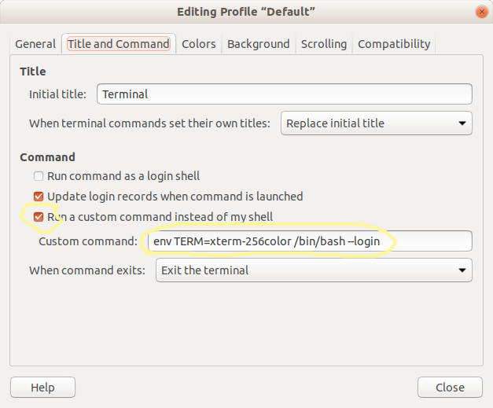

= Terminal Emulators

== Configure Mate Terminal for 256 colors

This configuration is especially useful if you use tmux or screen inside mate-terminal.

Open Mater Terminal's _profile preferences_, navitage to the tab _Title and Command_, and check _run a custom command..._. Then, write this in the _Custom Command_ input field:

[source,bash]
----
env TERM=xterm-256color /bin/bash --login
----

Close and open terminal and run `echo $TERM` to see if `TERM` env var is properly set.

NOTE: This `--login` setting is also necessary for `rvm`, otherwise it is unable to set default ruby and start with the default ruby set.

== Terminator

Multiple tabs and panes. Allows rearranging panes.

== Tilix

https://gnunn1.github.io/tilix-web/

Similar to Terminator, but seems to be more actively maintained.
