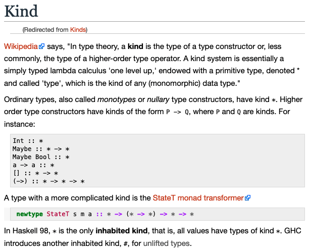

# Type and Data constructors and Kinds

## Intro

Unless otherwise noted, assume these pragmas directives for the next examples.

```hs
{-# LANGUAGE NoMonomorphismRestriction #-}
{-# ANN module "Hlint: ignore Use newtype instead of data" #-}
```

## Creating data types and data constructors

Type Constructors and Data Constructors can be *nullary* or *unary*.

Read [this Haskell Wiki entry](https://wiki.haskell.org/Kind) for theoretical information.

## kind

*Kinds* are types of types or “types one level up”¹ They are denoted by the asterisk `*`. It shows whether a type is fully realized or it is awaiting for arguments in order for it to be fully realized.

You can ask for the *kind* of a type constructor with `:kind` in GHCi:

```GHCi
λ> :kind Int
Int :: *

λ> :kind Num
Num :: * -> Constraint

λ> :kind Bool
Bool :: *

λ> :kind Fractional
Fractional :: * -> Constraint

λ> :kind Num
Num :: * -> Constraint
```

### nullary

`Thing` is a *nullary* type constructor which contains two *nullary* data constructors. That is, neither the type constructor `Thing` nor the data constructors `Foo` and `Bar` require arguments.

It is strange to call them *constructors* because they don't actually construct anything. They don't take arguments to do something (build, construct) a type or a value. In this case, they are themselves already a type `Thing` and the values for that type `Foo` and `Bar`. They are already fully realized. `Thing` is a type already, and `Foo` and `Bar` are values already. The Haskell Report calls them **constants**. (page 38, 41, 59) or online, under [4.1.2 Syntax of Types](https://www.haskell.org/onlinereport/haskell2010/haskellch4.html#x10-650004.1.2).

```hs
data Thing = Foo | Bar deriving Show

tf :: Thing
tf = Foo

tb :: Thing
tb = Bar
```

```GHCi
λ> :info Thing
type Thing :: *
data Thing = Foo | Bar
instance [safe] Show Thing

λ> :type Foo
Foo :: Thing

λ> :type Bar
Bar :: Thing

λ> :info Foo
type Thing :: *
data Thing = Foo | ...
```




### unary

`UnaryTypeCon` is a type constructor that takes one argument. `UnaryValueCon` is a value constructor that takes one argument.

```hs
data UnaryTypeCon a = UnaryValueCon a

u :: UnaryTypeCon Int
u = UnaryValueCon 1
```

```GHCi
λ> :kind UnaryTypeCon
UnaryTypeCon :: * -> *

λ> :kind UnaryTypeCon Int
UnaryTypeCon Int :: *
```

When kind is `* -> *` (note the `->` arrow), it means the type constructor has not been applied to any arguments, and is still awaiting one. When the kind is `*` (no `->`arrow), then the type is fully realized (either because it is an *unary* type constructor, or because it has been applied to the necessary arguments that make it a fully realized type).


data HuskyType a = HuskyData

myHusky :: HuskyType a
myHusky = HuskyData

otherHusky :: Num a => HuskyType a
otherHusky = HuskyData

yetAnotherJusky :: HuskyType Int
yetAnotherJusky = HuskyData

noWitnessToTheContraryHusky :: HuskyType [[[[Int]]]]
noWitnessToTheContraryHusky = HuskyData

------------------------------------------------------------------------
data DogueDeBordeaux doge = DogueDeBordeaux doge
  deriving Show

myDoge :: DogueDeBordeaux Word
myDoge = DogueDeBordeaux 0xff

dg :: DogueDeBordeaux [Int]
dg = DogueDeBordeaux [1, 2]

## References

- 1. Haskell From First Principles, page 390.
- [Kinds on the Haskell wiki](https://wiki.haskell.org/Kind)


