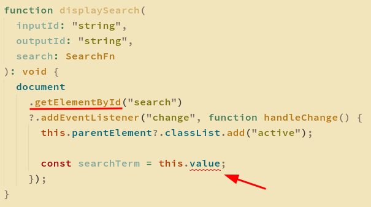
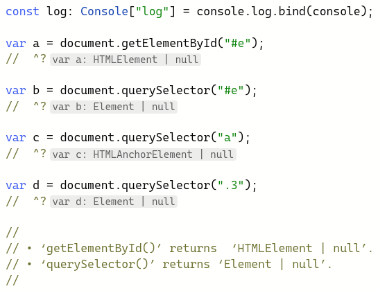

# Ch03 Functions


It is possible to assign a type of a function to a type:

```ts
function myFn(s: string, n: number): string {
  // Code goes here.
}

type Fn = typeof myFn;
```


## void

- https://fettblog.eu/void-in-javascript-and-typescript/

`undefined` and `null` are values, and but also types.

`void` is also a type in TypeScript.

- `undefined`: default return **value** in JavaScript;
- `void`: default return **type** in TypeScript;

The `void` type can only take `undefined` as value.

```ts
// NOK
var j: void = null;

// OK
var k: void = undefined;
```


If a return type of a function is `void`, it can only return the value `undefined`. We can substitute a callback function that should return `void` with functions that return any other type, but it will be handled as `undefined` in the caller.

- [Playground with void and undefined example](https://www.typescriptlang.org/play?#code/PTBQIAkIgIIQQVwC4AsD2AnAXBAYgU3QDsBDQgE1QgCFiBnW1cYaCZRRAB1sxADMCS5VACM6DAHRk8AN2ABjVIUTE5iMJBhtO3PgNIVR9VOIDmAS0QAbYsPFnUwKdLQB3RA6YstXHsBf-JGVd3QNlPUFAFQlpECEtUE2wAYUUGSzwAbQAieJMsgF0IAF4IKLS8cVzxYTNyAAoy1HSASgBuCMQATw48CABJRDwAW2KIAG9QCAgAR2wY9FqTdqmzMmxCeCHhAmWIRAt0ucQFwiXQAF920F54QlV7QggTPEQAJTxaeEtEOtmIecWzWwA2GGUKEym6Be8CIEAyEKmMwANJNEatsABGFGIvYHPDYLIAFWQvQA6sROrQIKheBBib0cBg5HgstiIOd8u1zhEbnd9op-nhiOg5MhfkcTiYkRBeNg6lh+oMhmDmsUAHwQaSoVZAzXasjjVFlWJQz7fUbPN4fL4-aZtVFQxAwx68eXW7727lMTyADAJcoBMAggjudVJ9tykvFqeDIPulLmQZlFEGIiFFHz2JKD0NhXR6nhpGd6cmIlksojkAGs4wmk2ZQ1rVj7xN7aEKRWKsgAraNmVlxBL2663e4Cy3vM2IAAyeFOKHlwKVKvWm226ENkOzj3QlRnJhQXIiIF9Y-dU93KEDwaIoY2WwIsYgwiQEAsL6pMTMpYgAHkANKedxCz2boixJSsCGbI9cjqVthVFOoux7PsTwnadZ2QZpB2AAAqCIfVg9sfT2YgK3TYhShLMs6DwatUFbf4zBMEgnShf4KSpV8hngGJQCvR4fQbGNxDpTNFEsTpNRLeAi1QIYOBTMxhHSCAXAsZAIAE-UiLrUAw3IPBI0IaMmwgAAJVAXBkAg4yLUgIHk+gKNLcsKxlYd+WiDMU14zdk0IToUEWFTkBTBgrO3ETelzUC8HAtdVK-FRmQ4RBQAsaUn1iBLLAgTtuNiQhUFiIYSKikKTV86Lk2kYhPxsZT3FAFBbNLILeRHQhhIGFTPxy7ZWH0dIDToDTwwMqMhIiYk6zff54GED8nWUGpLAsTpm1AbCwCHPkHkFODkAAOT-cV-mORZpVlCB50VUF8lVIoNUE3VBPXUpUgqicLReccbV+QcpkgAAeDE1QdXzXVNG1VQAaggDED29SBp0QAByd8hQkyyIArQqXBU3pakGcg9koBzQwI0Vjt-IjyOLZyVArADyqzFjPPI29V2lBgCYox4KCAn04YxIjAtOLrYgoD5CFR1LIBcDBXO2YtuLKqKQNKMDSPi3qIBK0ivIqtnJMsaTHzwTwQvIIbk1DMbDOM67moYpiUxhXoC1QGEnKoys2MpF9EGaTw+PrLTk14QY10o5pIPUZgAE0vb5+yxGTNzdoFFAU1ZkN-lk9WempZq12zwhfUEh9MogTpk+LGXYhMShhS9knaiA+nVtODOOr2dBOkWADKGOIVYlfEaipJNdNMbOOgA).
- [Playground showing the use of void in front of invocations to force return undefined](https://www.typescriptlang.org/play?#code/PTBQIAkIgIIQQVwC4AsD2AnAXBAYgU3QDsBDQgE1QgCFiBnW1cYaCZRRAB1sxADMCS5VACM6DAHRk8AN2ABjVIUTE5iMJBhtO3PgNIVR9VOIDmAS0QAbYsPFnUwKdLQB3RA6YstXHsBf-JGVd3QNlPUCZPAFVaPAhUXghADAJpVDMyJIh3CF4MOTjiHPhCVXtCLMp0PER4IghCVBQzQhNxSNAFQlpECEtUE2wAYUUGSzwAbQAiPpNJgF0IAF4ITtG8cRnxYWayAApV1DGASgBuCMQATw44gElEPABbJYgAb1AICABHbG70ZpMzh90thCPAHsICICshYxj9EH8WmcAL5nUC8YqlRQQEzVABKeFo8EsiF23wgv3+R2wd0e4wWbw+VRqdXGDI+XwANO92cCIABGLns6FWPDYSYAFWQcQA6sQLrR4olJXEcHk8JNBRAkXNkRF0SVEGVyXhiOg5MhSXCESYOTlsLssBAaQ86UclgA+CCpdJUr1pMivbmrHpVQnE544xD4sMkz6nCIfEDcyD45ldCAuZDEe7SAhZKXJXiZOTESyWURyADWECZtS6bUTYEZ1TrOQdBKJiHjSIiScgN0SLjiWdzEEKJbLFer+sx5RQ2ZrLaICsK0lL8DwtuESE8Q4zpB62VyZriFgqi7T+bia8sG4gAANilJeM08GR7xmLGgd5BzaRzC0V4QGYDwcGMDx4Eo2ZGgkQEzoaii2nuJblLQIFgRcngcFUL4AB7AYgCrNKkJYIeULhfsk3oZG0SZ6hiZHGqa5oAGr+pa5Lwv8tq8PajrOq6Hp+j62DUYGHzBouMYRniHbEqS8bJk2EApku6aZtmMh5igcRJEWKyluWKjVrWy4NipymmeUYm8O2MbdhEMy7LEzEWpMABWb5mBqNZCegGyQSYKBHPGkCAEmE-KOf0zkmmayBsekuweV5PnoH5AUtMFoXMBFT54C+hBvr26jMAAys0+TJC5cWZGYCpWf8GZZjm2kFhORlVgRsSWLwnh1RedbcRmcQoRA8CxFR-q1eUvDoKgTywUk1XmrVhF4D1njZDMECADgEDRNC0O1jgqQ5lrRYBOWJy1uZ5ZDebaaWLJ6-ljJlyAhWc4VjeQ+WvmQoBAA).
- [Playground showing use of ‘undefined‘ instead of ‘void to prevent substitutability](https://www.typescriptlang.org/play?ssl=9&ssc=68&pln=9&pc=4#code/PTBQIAkIgIIQQVwC4AsD2AnAXBAYgU3QDsBDQgE1QgCFiBnW1cYaCZRRAB1sxADMCS5VACM6DAHRk8AN2ABjVIUTE5iMJBhtO3PgNIVR9VOIDmAS0QAbYsPFnUwKdLQB3RA6YstXHsBf-JGVd3QNlPUCZPAFVaPAhUXghADAJ4cjxeM0I8MiSITNpEPGIyeMSk6VQzEvcIDnQZPCUIWnhhAoskGzNLCwBPcUjQBUICiEtUE2wAYUUGSzwAbQAicZMlgF0IAF4IYbm8cVXxYUyyAAo91HmASgBuCMRejjiASUKAW22IAG9QCAgAI7YAroTIme7-KrYQjwd7CAgQiCICzzYGIUGEcGgAC+91AvFSqnshAgJjwiAASngWpZEGcgc10WDrtg3nh3gtNr9-vVEPAiBAFtz-oCADR-EVQiAARnFIqRKLw2CWABVkHEAOrEXq0UoQNVxHAYOR4JZyiDY9b3bERAmEImKZpFdByZD0tEYkyiiC8bBnLAQNkc9bXbYAPggqSkGSyZBZEAqVR+Er2iAg9RpaZ2ZMp1PgtPpdwi-xAEsgVL5RF1LmQxEK0gISPVyV4uTkxEsllEcgA1unyfyRgMS2AeQOBbx-XnaUWbZFIDMlOhiOhekjKMRdh2uyo+7QzCYSJW4ig6-3KyNkomcp5hEgtySWm1kXzChAXBZkBBN+3O92+6eaa8oOuqkL0niPM8761ogDANOg3pmIkLhxO8xA9nEqD8luf67s0B5HvyJ6MJAwECikaS8LGuT5IUxR6uUlRkIAmATeigjTvnE7YkvUljgZAjpPu0r5dD0jzfuQ8TYXaDo8UUnZrrWuruJ4ZEkhR0aZNkuRnIQqBpjCcIEN6PQYck6DhumhyNCYKC5BQ1LXAMparGcsQrq6ZxLAAVtkZhmumlnoNZmIoNcRalpABoQAQ6AYHkup4AAHs8qjZBA8LtvAsRNlx27-glzTEFUEGUGpyRRukWk5BAZz6Jx371Oeg5gskhnwugSROYM87MAAcvpzREdBa4oe+WGWCU8Hrk2Zi0N6d5pmN3E+saeCeEkwXzKFyC5DU5UaVV1EZWudRVUlrUWO+n5XkxSTOcw0WQdSuUkmhiCug9oCue5Lpuj5fkBRZWwRteVnbbZyDhfcQA).


## this context







- [TS Playground with getElementById() vs querySelector()](https://www.typescriptlang.org/play?#code/PTBQIAkIgIIQQVwC4AsD2AnAXBAYgU3QDsBDQgE1QgCFiBnW1cYaCZRRAB1sxADMCS5VACM6DAHRk8AN2ABjVIUTE5iMJBhtO3PgNIVR9VOIDmAS0QAbYsPFnUwKdLQB3RA6YstXHsBf-JGVd3QNlPUFAFQlpECEtUE2wAYUUGSzwAbQAieJMsgF0IAF4IKLS8cVzxYTNyAAoy1HSASgBuCOlidAhiYogKOXgAWzwlUzxEAFF0kaUqAE8ASTI6rIBiPCy2zwgAPQB+Dq6IYT6B4dHEcQBHeAJ5gGU8dNUMVY2t9sg9w9BO7rkZ1Qg1mV1u9yeL3c6FWxE+OwOR26ZCBIMuNzu6EezzwrxhWXEAGZ4d9EUxPDBABgEJgm0zwoIWyzqzUAmAQQdATeBEWgQCCUgASABUALIAGTpoIgAB8IIR4JZLCzxBS+eCsZDcdDmWyOYgudE+RLLtLZfLFcqQBEgA)


With selectors other than tag names, `querySelector()` cannot possibly know which element was retrieved. Thus, it defaults to the lowest common denominator type, `Element`. `getElementById()` least common denominator is `HTMLElement`.


A lot of these interfaces are automatically generated by scraping web standard documents and looking for parts where interfaces are described in the web interface definition language (WIDL) format. The TSJS Generator20 con- verts WIDL files to TypeScript declaration files: a wonderful window into what’s going on in browser internals!

* [TS Playground: HTML Interfaces](https://www.typescriptlang.org/play?#code/PTBQIAkIgIIQQVwC4AsD2AnAXBAYgU3QDsBDQgE1QgCFiBnW1cYaCZRRAB1sxADMCS5VACM6DAHRk8AN2ABjVIUTE5iMJBhtO3PgNIVR9VOIDmAS0QAbYsPFnUwKdLQB3RA6YstXHsBf-JGVd3QNlPUFBpYnQIaTMyCABeCAo5eABbPCVxOXQ8YkQ8AFFLPEylAAoAIjipVCqASgBuTwgAPQB+CKA)


