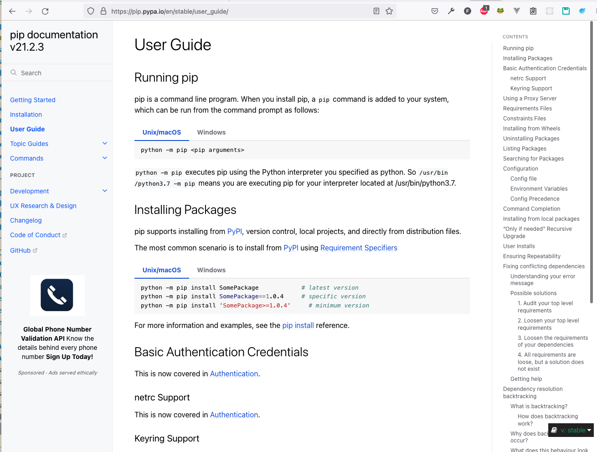
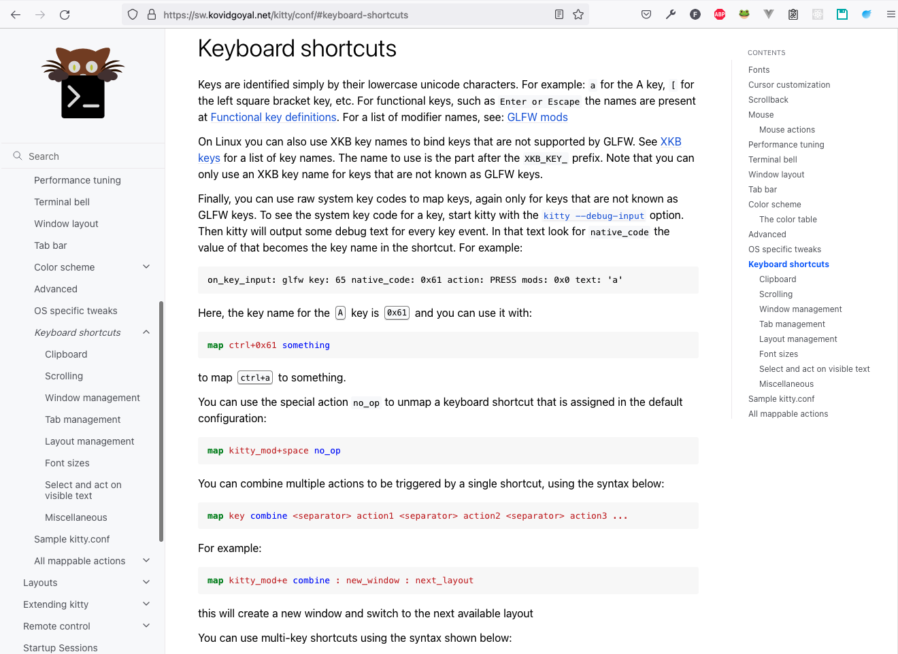
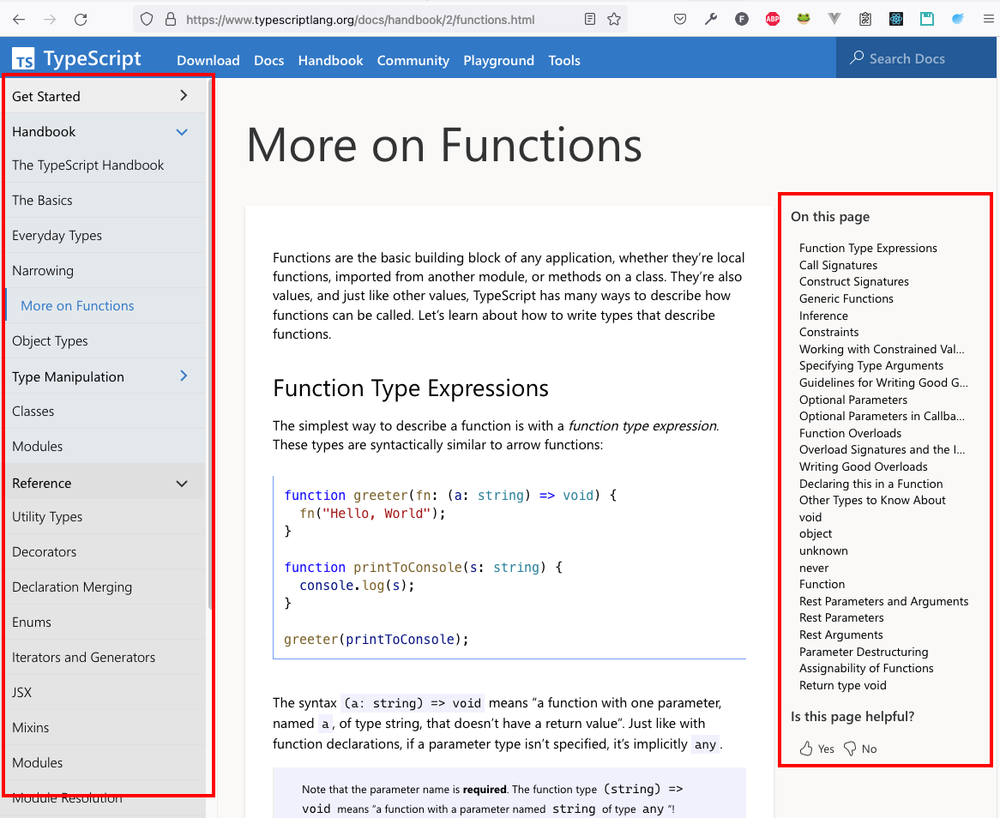

# Wiki

## List of Navigable Docs and Wikis

Wikis and documentation websites with Tree of documents one one side and the Table of Contents on the other side.

### pip, kitty

These use Sphinx with the theme called “furo”.

### yarn docs

This one seems to be with some Gatsby thing.

### Typescript Docs

With Gatsby and some other stuff with JS technologies.

