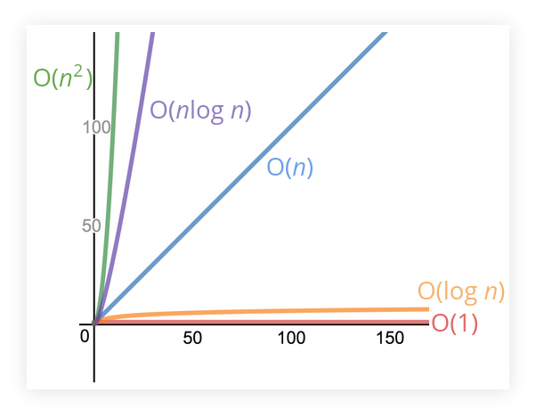

# Logarithms

A logarithm is the inverse of exponentiation.
[Math Is Fun](https://www.mathsisfun.com/algebra/logarithms.html) has a nice intro to the topic.
There is also Wikipedia, Khan Academy, etc.

Think of this question: “How many x's multiply together to make y”?
For example, “How many 2's multiply together to make 8?”
We multiply 2 three times to get 8.

- 2 * 2 * 2 = 8
- log₂(8) = 3

Therefore, log₂(8) = 3.
Read as “log base 2 of 8 is 3” or “the base-2 log of 8 is 3”.
In this example, 2 is the base, and 3 is the logarithm.
8 is the number we want to get by multiplying x n times.

- log₂(num) = exp → 2exp = num
- log₂(8) = 3 → 2³ = 8

There is also log base 3, base 3, or base *e*.
But for analyzing algorithms' time and space complexity, we only care about the general trend and therefore we often omit the base.
In general let's simplify that log = log₂, (even though a logarithm MUST have a base, that is, simply "log" is not a real math operation, we can use that simplification informally).

A loose definition is that a logarithm of a number roughly measures the number of times you can divide a number by 2 before you get a value that is less than or equal to one.

See this slide from Colt Steele for some visual clue on how good logarithimic time complexity fairs in comparison with some others:

- [Colt Steele Slides on Logarithms](https://cs.slides.com/colt_steele/big-o-notation#/28/0/5)

Types of algorithms that sometimes involves logarithmic time and/or space complexity:

- Certain searching algorithms have logarithmic time complexity.
- Sorting algorithms (especially some of the most efficient ones).
- Recursive algorithms sometimes have logarithmic space complexity.
