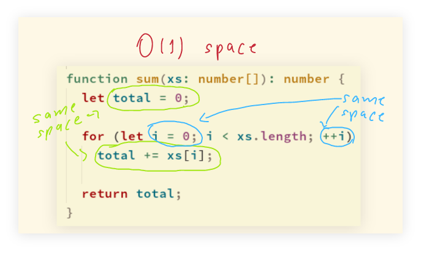

# Space Complexity Examples

## Sum Array of Numbers

Consider:

```typescript
function sum(xs: number[]): number {
  let total = 0;

  for (let i = 0; i < xs.length; ++i)
    total += xs[i];

  return total;
}
```

This simple and humble algorithm takes space for `total` and `i`.
When `i` is incremented or `total` is added to, the space does not change.
There is time complexity increase, sure, but the space complexity remains the same.
Incrementing a numeric variable doesn't take *more* space.
Therefore, this algorithm's space complexity is O(1).



- [See drawing on Onenote](https://onedrive.live.com/redir?resid=9AFB7727964AE703%21650&authkey=%21ABP34qAE2QaSFk0&page=View&wd=target%2803%20BigO%20Arrays%20and%20Objects.one%7C3ebd2ca2-55fb-4436-9eb3-372198d403dc%2FSpace%20Complexity%7C0b3691e3-bc92-4cea-a6fa-a135cf9ae773%2F%29&wdorigin=703)
