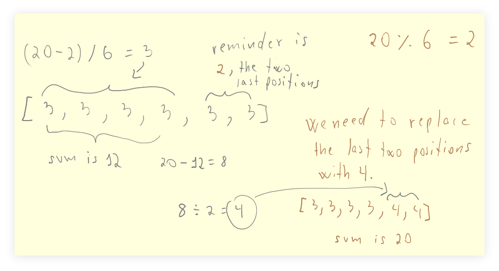

# Split Int Into Even Parts

tags: [math, integer, division, remainder, modulo]

Divide an unknown integer into a given number of even parts — or at least as even as they can be, and the parts are returned as an array.
The sum of the parts should be the original value, but each part should be an integer, and they should be as close as possible.

Examples:

```text
spitInt(10, 1)
→ [10]

split(10, 3)
→ [3, 3, 4]

split(20, 6)
→ [3, 3, 3, 3, 4, 4]
```

There is some math stuff behind this, and it involves integer division and remainders (modulo division).
Let's consider splitting 20 into 6 parts.

```text
20 % 6 = 2

(20 - 2) / 6
   18 / 6
     3
```

We then fill all six positions in the array with 3: `[3, 3, 3, 3, 3, 3]`.

The remainder is 2, which means the last two positions need to be worked some
more and cannot be simply left as 3, else the total sum is 18, not 20.

The first four positions are OK, though, and their sum is 12, which
means the last two positions that have to be worked some more must
sum to 8, since 12 + 8 would be 20, our initial number.

8 / 2 is 4. We fill the last two elements with 4.



## TypeScript

### Unit Tests

:::{literalinclude} /../src/algds/ts/split_int_even_parts/splitInt.test.ts
:language: typescript
:::

### v1

:::{literalinclude} /../src/algds/ts/split_int_even_parts/splitInt_v1.ts
:language: typescript
:::

### v2

:::{literalinclude} /../src/algds/ts/split_int_even_parts/splitInt_v2.ts
:language: typescript
:::


## References

- [Split a number into n numbers (Math StackExchange)](https://math.stackexchange.com/questions/2975936/split-a-number-into-n-numbers).
- [How to divide an unknown integer into a given number of (almost) even integers (StackOverflow)](https://stackoverflow.com/questions/56107612/how-to-divide-an-unknown-integer-into-a-given-number-of-almost-even-integers/64245018).
- [Split number into equal parts or what's closest to that](https://stackoverflow.com/questions/36414923/split-number-into-equal-parts-or-whats-closest-to-that).
