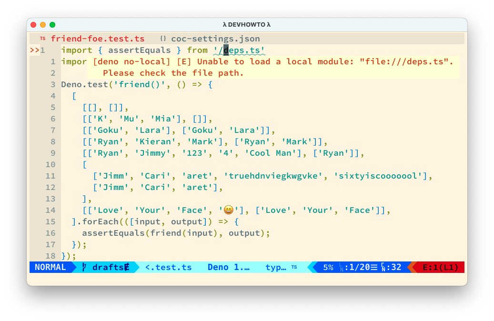

=====================================================
Project Root Absolute Imports and Import Maps in Deno
=====================================================

.. _deno project root absolute imports:

Intro
-----

Deno uses `import maps`_ to provide, among many other things, the
ability to use project root absolute imports! Also see the `WIWG
import maps proposal`_.

.. _`import maps`:
   https://deno.land/manual/linking_to_external_code/import_maps

.. _`WIWG import maps proposal`:
   https://github.com/WICG/import-maps

The Problem
-----------

Following the documentation linked just above, we have this import
map:

.. code-block:: text

   $ sed '' ./import-map.json
   {
     "imports": {
       "/": "./",
       "./": "./"
     }
   }

And in our TypeScript files, we have things like:

.. code-block:: typescript

   import { assertEquals } from '/deps.ts'

And we, for example, run the tests with:

.. code-block:: text

   $ deno test --import-map=./import-map.json ./src

It works for for Deno but breaks our editors 😭. When we attempt to
use an import map to do project root absolute imports, our editors
throw a fit thinking we are trying to import something form the root
of our file system, not from the root of our project.

The catch is that the forward slash ``/`` has been used to indicate
“root of the file system” on Unix since the Big Bang. And editors have
followed suit.

The Solution
------------

The solution is simple. Instead of using ``--import-map`` on the
command line, we can add it to the local Deno project configuration.

Vim
~~~

.. _coc-deno:
   https://github.com/fannheyward/coc-deno

In vim, with coc-deno_ we simply do

.. code-block:: text

   :CocCommand deno.initializeWorkspace

if you are starting from scratch, or:

.. code-block:: text

   :CocLocalConfig

to update the config (which lives in ``.vim/coc-settings.json``, by
the way).

The name sure it has the line ``"deno.importMap":
"./import-map.json"``. Mine currently looks like this:

.. code-block:: json

   {
      "deno.enable": true,
      "deno.lint": true,
      "deno.unstable": false,
      "deno.importMap": "./import-map.json",
      "tsserver.enable": false
    }

As soon as you do this (and save the file), the error about the import
path should go away.

VSCode
~~~~~~

In VSCode, install the Deno extension and from VSCode command palette
run:

.. code-block:: text

   Deno: Initialize Workspace Configuration

Again, make sure you have something like ``"deno.importMap":
"./import-map.json"`` somewhere in ``.vscode/settings.json``. Mine
currently looks like this:

.. code-block:: json

   {
      "deno.enable": true,
      "deno.lint": true,
      "deno.unstable": false,
      "deno.importMap": "./import-map.json"
    }

