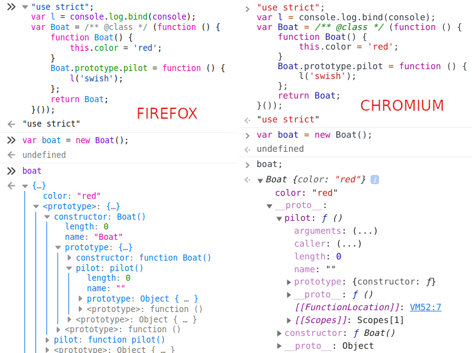
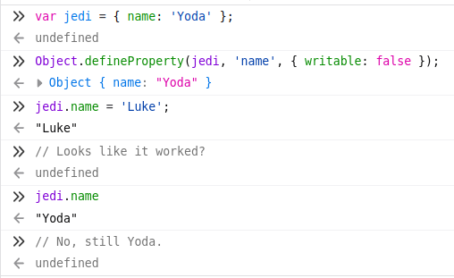

==========
Decorators
==========

JavaScript Prototype vs Classes
-------------------------------

.. code::

   const l = console.log.bind(console);

Study this:
`MND link on Object
<https://developer.mozilla.org/en-US/docs/Learn/JavaScript/Objects>`_.

`Typescript playground
<https://www.typescriptlang.org/play?target=1&jsx=0#code/MYewdgzgLgBANjAvDUkRwKYDo4gOZYBGAlmACYAUqE6GAlANwBQTwcAhhBDAEIjuwA3kxgwADgCdiANwEYU6EBIBcMaFLB4kMAOQSMZHcxHiAroTjFg44rigU6q6SGJkYw0aLgUdEAO7EEAAWOowmAL5MkUA>`_.

.. code:: ts

   class Boat {
     color = 'red';

     public pilot() {
       l('swish');
     }
   }

The above gets translated to ES5 as:

.. code:: js

   "use strict";
   var Boat = /** @class */ (function () {
       function Boat() {
           this.color = 'red';
       }
       Boat.prototype.pilot = function () {
           l('swish');
       };
       return Boat;
   }());

Neither ``<prototype`` (Firefox) nor ``__proto__`` (Chromium) actually
exist in the spec. They are added by the browsers JS engines to help
with debugging.

Plain property literals are added directly on the constructor. Methods
(functions) are added to the constructor's “prototype”.

TypeScript Decorators and Properties
------------------------------------

.. note::

  Properties (literal ones, not methods or accessors) are
  added to the constructor function, not to the prototype of a class.
  Decorators' first argument is always the prototype of the class. So,
  decorators do not have access to an instance's property.

Decorators on properties basically only let's us know that that key is
something like “color” or “jedi”, but you can't access or manipulate
their values.

.. code:: ts

   type Decorator = {
     (target: any, key: string): void;
   };

   const myDecorator: Decorator = (target: any, key: string): void => {
     // Always undefined. ‘target’ is always the prototype of the
     // thing being decorated. ‘skill’ is not defined on ‘Jedi.prototype’.
     l(target[key], target.skill);
   };

   class Jedi {
     // This property gets added to the constructor function, no to
     // the prototype property.

     @myDecorator
     public skill: string = 'Lightsaber';
   }

TypeScript Decorators and PropertyDescriptors
---------------------------------------------

When we create a “class”, we actually create a constructor function
(remember that ES6 classes are just syntax sugar — they do not bring any
new paradigm or concept to EcmaScript), and define a prototype on that
constructor function.

The first argument of a decorator is the prototype of the class. The
target of a decorator lists only methods and accessors (getters and
setters). Plain, literal properties are defined on the constructor
function, not on the constructor function prototype.

The second argument of the decorator is the key, the name of the
method/accessor.

There is also a third argument, the ''PropertyDescriptor'' which is used
to “override” the default behavior of the thing being decorated.

.. note::

  Decorators are only run when the code is first parsed, i.e. when a
  class is defined, not when the class is instantiated. When you “run a
  file” that defines stuff, the decorators are run. It is like they are
  run when the engine is parsing and interpreting the code in the file,
  BEFORE any code is actually run. But, inside the decorator, we can
  override what will happen when methods or class stuff is actually run.

Decorators are basically called with:

.. code:: js

   myDecorator(MyConstructor.prototype, 'someMethodFromMyConstructor');

``PropertyDescriptor`` is part of ES5.

.. warning::

  If we make a typo, and spell it wrongly, like “writtable”, JS gives us
  NO ERRORS, but it will just leave the property still writable.

