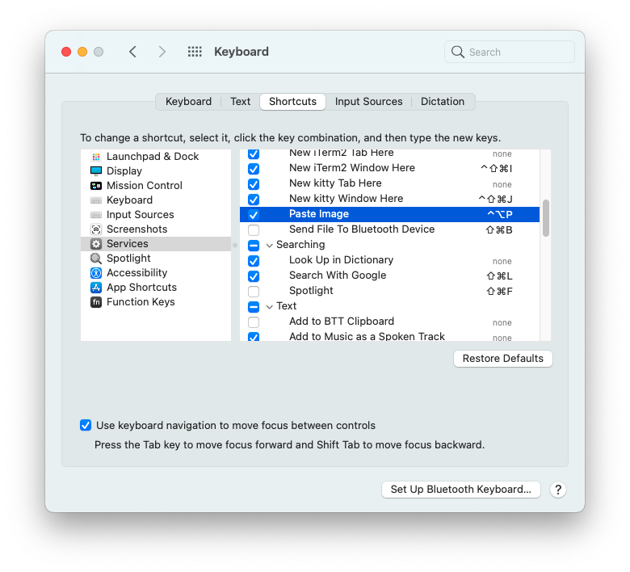
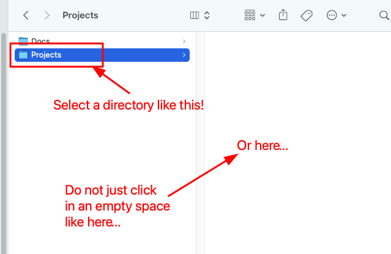

=======================
Paste Image Into Finder
=======================

.. _pngpaste: https://github.com/jcsalterego/pngpaste

We can use pngpaste_ to paste images from the clipboard into a directory:

.. code-block::

   $ pngpaste "$(date +'%Y-%m-%d-%H-%M-%S'-my-image.png)"

The Bash Script
---------------

Let's come up with a shell script and integrate it with macOS Quick
Actions service.

.. code-block:: bash

   cur_date_time=`date +'%Y-%m-%d-%H-%M-%S'`
   dir="$@"
   dst="$dir/`date +'%Y-%m-%d-%H-%M-%S'`-my-image.png"
   logfile=~/Desktop/paste-image.log.txt

   echo -e "\n\n$cur_date_time: Paste Image" >> "$logfile"
   echo $BASH_VERSION >> "$logfile"
   echo "$dst" >> "$logfile"

   /usr/local/bin/pngpaste "$dst"

Using Quick Actions
-------------------

Open “Automator” → “Quick Action” then search for “Run Shell Script” and
select it. Then, check:

- “Workflow receives current” **folders**
- “in” ``Finder.app``

Below that, for the script, check:

- “Shell” ``/bin/bash`` (or something like ``/usr/local/bin/bash`` if
  you have a more recent version, perhaps installed with brew)
- “Pass input” **as arguments**.

.. image:: ./finder-paste-image.assets/2021-08-08-11-41-42-my-image.png
   :alt: macos quick action paste image with pngpaste

Add Keyboard Shortcut
---------------------

Open Keyboard settings → Shortcuts → Services → Paste Image and set
the desired shortcut.

**NOTE**: I tried ``Cmd+p`` and ``Shift+Cmd+p`` and it simply would
not work. It turns out if some keyboard shortcut already exists with
that combination it simply won't warn you, but it will just not
work. I tried ``Ctrl+Option+p`` and then it worked.

.. note::

   For some reason, a folder has to be selected, not just “entered
   into”. See this screenshot:

Then, with a folder selected, press ``Ctrl+Opt+p`` to paste the image
into the selected directory.

References
----------

- https://github.com/jcsalterego/pngpaste
- http://hints.macworld.com/article.php?story=20100509134904820

