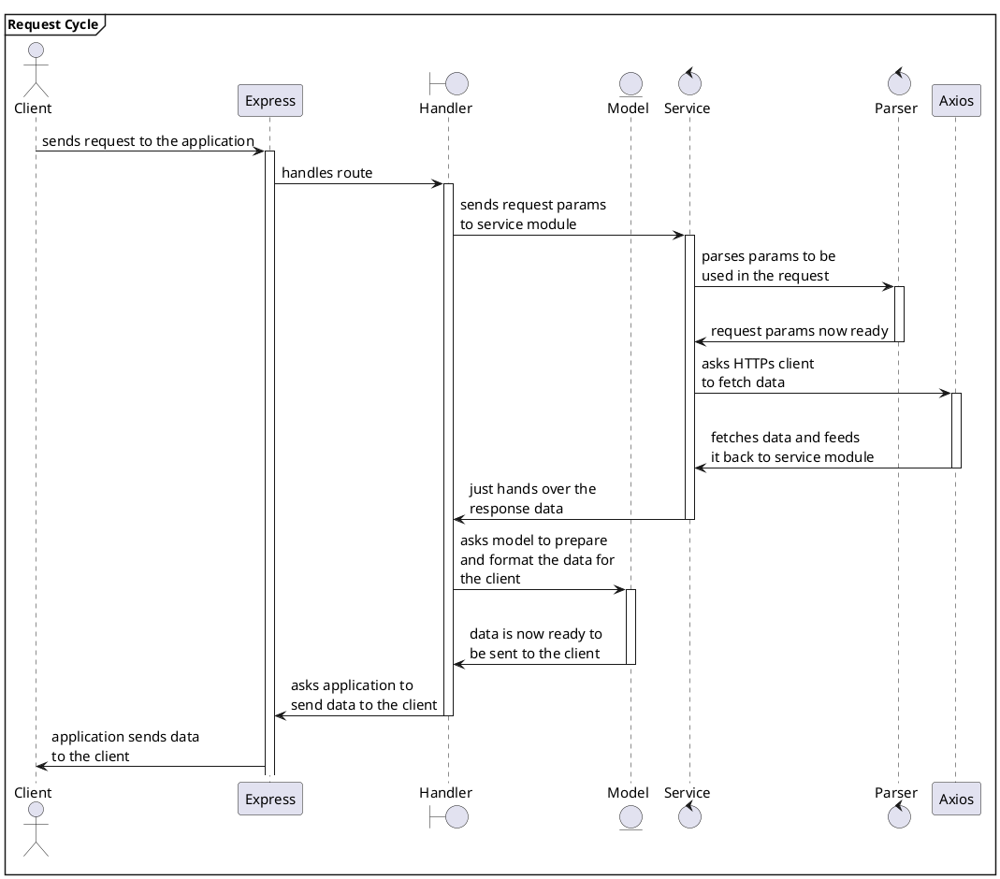

# PlantUML on Sphinx/Read The Docs

## Intro

We want to use PlantUML to add diagrams (using the concept as Diagramas as Code, just like we have Infrastructure as Code, etc.)

We want to write and see diagramse like the following:

:::{uml}


Check more diagrams on our [SOLID Principle pages](https://www.devhowto.dev/solid-principles/dependency-inversion-principle.html).

We'll need:

- [Sphinx](https://www.sphinx-doc.org/en/master/usage/quickstart.html), the documentation generator which allows writting in both reStructuredText and Markdown.
- [PlantUML](https://plantuml.com/) to generate diagrams of any kind.
- [sphinx-contrib/plantuml](https://github.com/sphinx-contrib/plantuml) to allow embedding diagrams into the output content during build.

## sphinxcontrib-plantuml

Add something like this to your `./docs/requirements.txt`:

```
sphinxcontrib-plantuml==0.25
```

The file should look like this:

```{code-block}
:caption: ./docs/requirements.txt

##
# https://myst-parser.readthedocs.io/en/latest/index.html
#
myst-parser==2.0.0

##
# https://github.com/pradyunsg/furo
#
furo==2023.5.20

##
# https://github.com/sphinx-contrib/plantuml
#
sphinxcontrib-plantuml==0.25
```

## plantuml package on the container

Read The Docs uses (probably Docker) containers to build your docs.
The possible settings for `.readthedocs.yaml` are mentioned [in their docs](https://docs.readthedocs.io/en/stable/config-file/v2.html).

Let's use one of the allowed values for the OS as per [ReadTheDocs configuration schema](https://github.com/readthedocs/readthedocs.org/blob/5508303484cc72e6244633ef1a1ad5e48b6a98b1/readthedocs/rtd_tests/fixtures/spec/v2/schema.json#L85-L92).

We should have a `.readthedocs.yaml` that looks like this:

```{code-block} yaml
:caption: ./.readthedocs.yaml
:lineno-start: 1
:emphasize-lines: 13,23,24

#
# https://docs.readthedocs.io/en/stable/config-file/v2.html
#

version: 2

build:
  ##
  # Which OSes are available? See:
  #
  # • https://docs.readthedocs.io/en/stable/config-file/v2.html#build-os
  #
  os: ubuntu-22.04

  tools:
    python: "3.11"

  ##
  # We need this in combination with sphinxcontrib-plantuml (python/pip
  # dependency)so PlantUML diagrams can be generated and embedded into
  # the output during build.
  #
  apt_packages:
    - plantuml

##
# Build documentation in the "docs/" directory with Sphinx
#
sphinx:
   configuration: docs/conf.py

##
# • https://docs.readthedocs.io/en/stable/guides/reproducible-builds.html
#
python:
   install:
   - requirements: docs/requirements.txt
```

:::{note}
As of this writing (Jun 2023), they allow these:

```json
{
  "os": {
    "title": "Operating System",
    "description": "Operating system to be used in the build.",
    "enum": [
      "ubuntu-20.04",
      "ubuntu-22.04"
    ]
  }
}

[The docs](https://docs.readthedocs.io/en/stable/config-file/v2.html#build-os) should have an up to date list, though.
```
:::
