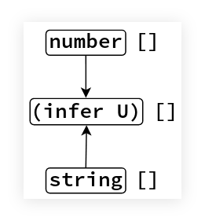

# infer keyword | TypeScript

[TypeScript 2.8 introduced Conditional Types](https://www.typescriptlang.org/docs/handbook/release-notes/typescript-2-8.html), and with it, the `infer` keyword.

In this post, we'll investigate how to understand and use the `infer` keyword through several examples.
We'll create and use *type utilities* for this purpose.

**INFO**: Utility types, or type helpers (like `ReturnType<T>` or `Nullable<T>`) **work on types**.
They take and return types. They do not take or return values.
They work on *type context*, not in *expression (value) context*.

## ReturnType

The `infer` keyword can only be used with conditional types.
The quintessential example of it  is use is with the utility type `ReturnType`:

```typescript
type ReturnType<T> =
  T extends (...args: any[]) => infer R
  ? R
  : any;
```

Given some type `T`, if it looks like a function, then return its inferred return type `R`; otherwise return `any`.

### Some Details

Technically, `(...args: any[])` and `(...args: any)` are the same thing.
By definition, `any` being a *top type* which includes all types in the known and unknown universes, also also includes `any[]` (or `Array<any>`)
. However, `any[]` more correctly **conveys intent** that we are dealing with an array of arguments.

Also, we could probably write the utility type `ReturnType<T>` to return `unknown` instead of `any`:

```typescript
type ReturnType<T> =
  T extends (...args: any[]) => infer R
  ? R
  : unknown;
```

Or even `never` (the empty type/set ∅):

```typescript
type ReturnType<T> =
  T extends (...args: any[]) => infer R
  ? R
  : never;
```

The difference would be when passing something that was NOT a function.

## Back to ReturnType

One very important thing to note is that `ReturnType<T>` **takes a type**, not a value.

```typescript
type F1 = ReturnType<() => void>;
// → void

type F2 = ReturnType<() => string | string[] | undefined>;
// → string | string[] | undefined
```

Note the type parameter passed to `ReturnType<T>`.
We are passing a **type**, not a value. Both `() => void` and `() => string | string[] | undefined` are function types, not function values.

- [TS Playground function type](https://www.typescriptlang.org/play?#code/PTBQIAkIgIIQQVwC4AsD2AnAXBAYgU3QDsBDQgE1QgCFiBnW1cYaCZRRAB1sxADMCS5VACM6DAHRk8AN2ABjVIUTE5iMJBhtO3PgNIVR9VOIDmAS0QAbYsPFnUwKdLQB3RA6YstXHsBf-JGVd3QNkmUFBEAE8OPAgAJTxEAB4AFQA+CABeUAgIVIg8AA9EPHJaCAAKcRridBNuCFIogG0AXQBKbMyzQn50BNyIAH5BvOx4QgBrQlQXQgBuCOjY3ABGbISk5MqurMzpVDMydKXIPIA9YeWYuJwAJk3ElN3uiFpEdF6TCAAfd8+33afwgkykvF6eBOZ2Yl2uQA)

We can pass a function value and see it does not work:

```typescript
/**
 * Retrieves the value of the property `age` on the given object.
 *
 * @param o Any object that contains the property `age`.
 * @return The age or `undefined` if not available.
 */
function getAge(o: { age?: number }): number | undefined {
  return o?.age;
}

type GetAgeReturnType = ReturnType<getAge>;
//
// ERROR:
//
// 'getAge' refers to a value, but is being used as a type here.
//
```

OK, we need to provide the *type* of  `getAge()`.
Well, we can use `typeof` type operator, which in `TypeScript` can also be used in *type context* (not only in *expression context*) to get the type of the function:

```typescript
type GetAgeReturnType = ReturnType<typeof getAge>;
// → number | undefined
```

- [TS Playground typeof function value](https://www.typescriptlang.org/play?#code/PTBQIAkIgIIQQVwC4AsD2AnAXBAYgU3QDsBDQgE1QgCFiBnW1cYaCZRRAB1sxADMCS5VACM6DAHRk8AN2ABjVIUTE5iMJBhtO3PgNIVR9VOIDmAS0QAbYsPFnUwKdLQB3RA6YstXHsBf-JGVd3QNkmUFBEAE8OPAgAJTxEAB4AFQA+CABeUAgIVIg8AA9EPHJaCAAKcRridBNuCFIogG0AXQBKbMyzQn50BNyIAH5BvOx4QgBrQlQXQgBuCOAAKhXclYSk9DMZPAqUOOliS3g41F4IQ4gOdFRY9GiIAANiEzxniEUr5DjzaTKX2EACs8KpxBsIJCAAIcOrEAC2XzghCiQNBqh+xEQEAUSmIvQOvxudweT1e72eEIgm2h6CS8CI+WJb3OA2ekykvF6eDInzMl1mOOIxzM1mEljw1JWYF4k1U9kIEHeiFg70qqGwAG8mu9hthCPAEcICBAAL4dA1Gk0DAA+EE5eG5hF5EC1Q3piEZStQw3ErKWZoi0ViEAA4kk1XhEl6iKkYnEslsUiG8BdlZH3uklpA8gA9YagIA)

## Examples Explained

### FirstArg Type Utility

Here we have a utility type that returns the type of the first argument of the given function type:

```typescript
type FirstArg<FnType> =
  FnType extends (p1: infer P1, ...args: any[]) => any
  ? P1
  : never;
```

`FirstArg` utility type takes a type (not a value), and try to see if it looks like a function type.
Note that it tries to match a first argument `p1` plus any potential remaining arguments `...args` and the return `any`.
The remaining arguments and the return type must be there to satisfy the required syntax, but what matters is the portion `p1: infer P1`.
If it successfully matches a function type, then the conditional returns the inferred type `P1`, otherwise, return `never`.

The identifiers `p1` and `P1` could be any other names, like simply `p` and `P`, or `first` and `First`, `foo` and `Bar`, etc.

Let's see what happens if we pass types that are NOT function types:

```typescript
type T0 = FirstArg<string>;

type T1 = FirstArg<number | null | undefined>;

type T2 = FirstArg<Record<string, number>>;
```

Since the provided types are not function types, the conditional fails to match a function type, and `T0`, `T1` and `T2` are all of the type `never`.
There is no way to infer the first parameter of something that is not even a function.

What about this:

```typescript
type T3 = FirstArg<() => void>;
```

We do pass it a function type, except it has no arguments. `never` is returned only if what we pass is not a function type.
Here, it **is** a function type. But it is impossible infer a first parameter that doesn't exist.
TypeScript infers it as unknown in this case.

Finally, some examples that actually return the type of the first argument:

```typescript
type T4 = FirstArg<(x: number) => void>;

type T5 = FirstArg<(xs: number[], s: string) => void>;

declare function g(s: string, n: number): void;

type T6 = FirstArg<typeof g>;
```

These all return the type of the first argument correctly.
Special note to `T6`.
Remember that we must provide a type, not a value.
That is why we use `typeof g` here.

- [TS Playground FirstArg](https://www.typescriptlang.org/play?#code/PTBQIAkIgIIQQVwC4AsD2AnAXBAYgU3QDsBDQgE1QgCFiBnW1cYaCZRRAB1sxADMCS5VACM6DAHRk8AN2ABjVIUTE5iMJBhtO3PgNIVR9VOIDmAS0QAbYsPFnUwKdLQB3RA6YstXHsBf-JGVd3QNkmUFBEAE8OPFwzdFpEWHQTAB4cQgAVGLwAPggAXlAIXGzciDwAD0Q8cloIAAoOAEZsM0J+dAgABRaAGghxYeJU7ghSKIBtAF0ASiKCyZKIAH5elpXsQhkCAG4I6NiILIAGIvjE5NS0pPQOkzyDyIqsloucBKSU9MJ4AFthAQIAAfCB-SyWUEQeDkPC8Dp4MhPQ6vABMHy+13SACU8Ap0GRboh7oQTIM-oCCHkUajjlkAMyYq4-NKNBaFArSVBmZHPI5xLIAFmZ3xujSq2wBQPQHK5PL5dMFAFZRdi2VVxpSZbNBuM7g85RBubzaVI5NZ0HFeLDVPZCBATI19SSHhSpVTZdgTWR+a8AGxq1kC1C8R0ooA)

### SecondArg Type Utility

Here's the implementation:

```typescript
type SecondArg<FnType> =
  FnType extends (_: any, p2: infer P2, ...args: any[]) => any
  ? P2
  : never
```

We don't care about the first parameter.
It is there to satisfy the syntax and consume the first positional parameter so we can focus on the second one.
Notice it *has* to be `any`.
If we make it `unknown`, or the `{}` type, it would only match when the type of the function passed would really be of that type.
But since any is a *top type* that encompasses all other types, it is perfect for this case.

```typescript
function getProp(obj: { [k: string]: number }, key: string): number {
  return obj[key];
}

type T1 = SecondArg<(x: number, s: string) => void>;

type T2 = SecondArg<typeof getProp>
```

`T1` is `string` and `T2` is `number` (again note the use of `typeof` on *type context*).

- [TS Playground SecondArg](https://www.typescriptlang.org/play?#code/PTBQIAkIgIIQQVwC4AsD2AnAXBAYgU3QDsBDQgE1QgCFiBnW1cYaCZRRAB1sxADMCS5VACM6DAHRk8AN2ABjVIUTE5iMCFBMmEAKq08EVLwgADAJaF+6ExADWeAJ4B3DGQiJKc9HmKIDxdwcOAyQzABszRAd3ZF9tb0R4IloYgyjgw2MUA30FcggOYnRiAFs8P3RMiADeeEJVM0VxLVB0gwBlPDyyWHQAcwAeHEIAFSC8AD4IAF5QCFxR8Yg8AA8-chSACgB9bFIHABoCgCZsCysIAAVjo-E7or7uasIHAG0AXQBKGan9uYgAPxXY7-bCEGQEADcmlq9UQjUIED65Uu6FQHE2IgAVtgAN4QV62bC0RDoCx9d5g+AlYQECAAXyO9gcxNJ5M+VJpdNx-wSSUR2MJjne0PpmjaEBGAEYZhBOt1eoNNitObT0EcniSyYQ+t9plNpKgzGQJtDWksRsdZfLFD1+gM2kYkSi0RxTZogA)

### ArrayItemType Type Utility

Recall that we can write array types in two ways, one using bracket syntax, the other using generic syntax:

```typescript
let xs: number[];
let ys: Array<string>;
```

If we have an array `xs`, and want to infer the type of the elements, we can create a generic utility type — let's call it `ArrayItemType` — which uses a combination of a generic type parameter and `infer`.

Bracket syntax:

```typescript
type ArrayItemType<T> = T extends (infer ItemType)[] ? Item : unknown;
```

Note that instead of  `type[]` syntax, we use `(infer ItemType)[]` (note the parenthesis an the brackets outside the parenthesis).
The `(infer ItemType)` thing stands for `type` in `type[]`.
In other words, `(infer ItemType)` is the `string` in  `string[]` or `number` in `number[]`.



Generic syntax:

```typescript
type ArrayItemType<T> = T extends Array<infer Item> ? Item : unknown;
```

In any case, we now have a generic that extracts the type of the elements of an array:

```typescript
let xs: string[];
let ys: Array<Record<string, number>>;
let jedis: Array<{ name: string, level: number }>;

type T1 = ArrayItemType<string[]>;

type T2 = ArrayItemType<typeof xs>;

type T3 = ArrayItemType<typeof ys>;

type T4 = ArrayItemType<typeof jedis>
```

- `T1` is `string`. We are passing an explicit type.
- `T2` is also `string`.
  We are using the value `xs` but in combination with `typeof`.
  Remember: type utilities take (work on) types, not values.
- `T3` is of type `{ [k: string] :number }`.
  Again we use a *value* with `typeof`.
- `T4` is of type `{ name: string, age: number }`.
  We are getting the type of the array items, and each array item an object with the properties `name` and `age` whose types are `string` and `number` respectively.

**NOTE**: Arrays must have elements of homogeneous types (unlike tuples).
Our utility type works on these sorts of arrays, not tuples.

- [TS Playground for ArrayItemType](https://www.typescriptlang.org/play?#code/PTBQIAkIgIIQQVwC4AsD2AnAXBAYgU3QDsBDQgE1QgCFiBnW1cYaCZRRAB1sxADMCS5VACM6DAHRk8AN2ABjVIUTE5iMCFBMmEAKq08EVLwgADAJaF+6ExADWeAJ4B3DGQiJKc9HmKIDxdwcOAyQzABszRAd3ZF9tb0R4IloYgyjg1IhIvABbFKMIUkL0dGIHcS1QMLxECAAPbghaRHQLAHMAbQBdAG4qmogHRtgSsoAeACU8BXQyMebWwjaAGghCeBzhAgA+bb7q2oArPDIzYdGHMYBvNeIcvGwF9tXq6Tww7HXNgggAXz3NOkDCNSg4AJJ+HIAFSCeDGUO2EAAvBAoRA8HU-OQUgAKCxWCAQ3IASm6EAA-ITIRBsPBCLZCKgnIQ+togVTcjDgvDESi0RisWQUiDxvifkScojKRKaRA6QymSzAbDUQBGZFwC4Srlwp5LboA0DsqEAJg1IvBkJ1YyBBQahuNAGZzVqrbCbbCCkMHSqoQAWF2g7Xu23GY6nWgAoA).

**NOTE**: Some people would call this utility type `UnpackArrayType` or `UnboxArrayType`, since we are conceptually *unpacking*, or *unboxing* nested type.

## UnboxObjType, `infer' in Co-variant Position

The [2.8 TypeScript release notes say](https://www.typescriptlang.org/docs/handbook/release-notes/typescript-2-8.html#type-inference-in-conditional-types):

> Multiple candidates for the same type variable in co-variant positions causes a union type to be inferred.

Let's understand what it means through examples.

This utility type takes some type `T`.
If it is an object containing the properties `x` and `y`, return an *union* type of the type of those properties; else return the empty/uninhabitable type `never` (∅).

```typescript
type UnpackObjType<T> =
  T extends {
    x: infer P,
    y: infer P,
  } ? P : never;
```

And then we use the utility to unpack the type of an object:

```typescript
type T1 = UnpackObjType<{ x: 1, y: "one" }>;
```

First of all, `{ x: 1, y: "one" }` above is **not** an object, but a type!
That object-looking thing is being used in *type context*, not in *value (or expression) context*.
It says the property `x` has the value type (or literal type) `1`,
and the property `y` has the value type (or literal type) `"one"`.

`T1` type is the union `1 | "one"` because “multiple candidates for the same type variable in co-variant positions causes a union type to be inferred.”
The “same type variable” is our uppercase `P`, and it is in *co-variant* (*contra-variant*) position.

Note that a type with different keys will not match and will return `never` (the order of properties doesn't matter, only their names):

```typescript
type T2 = UnpackObjType<{ y: "one", x: 1 }>;

type T3 = UnpackObjType<{ y: 1, z: "one" }>;
```

`T2` is still `1 | "one"` (the order of property names doesn't matter, as ECMASCript objects are unordered collections of key/value pairs, unlike arrays, where order is maintained), but `T3` is `never`, because the conditional type fails to match (it has to match all properties).

We can also use an object in conjunction with `typeof` type operator:

```typescript
const o1 = { x: 1, y: "one" };
//
// What if someone did o1.x = "Gotcha!!!" here?
//
type T4 = UnpackObjType<typeof o1>;
```

In this case, `o1` is indeed an object (not a type).
Someone could modify this object and change `1` and `"one"` to some other values, like doing `o1.x = "foo"`.
(Yes, `const` in ECMAScript is misleading...).
Therefore, TSC cannot say, “I'm sure x is 1 and y is "one"”, because it could be changed.

`T4` is not `1 | "one"` (because both values could have been changed between the object creation and its use), but `number | string`.

In this next example, we use *const context* to lock `o2` so it cannot ever be changed again.
`x` is not `number`, but the value type `1`, and `y` is not `string` but the value type `"two"`.

```typescript
const o2 = { p1: 1, p2: "one" } as const;
type T5 = UnpackObjType<typeof o2>;
```

`T5`'s type is, therefore, the union type `1 | "two"`.

- [TS Playground infer co-variant union type UnpackObjType example](https://www.typescriptlang.org/play?#code/PTBQIAkIgIIQQVwC4AsD2AnAXBAYgU3QDsBDQgE1QgCFiBnW1cYaCZRRAB1sxADMCS5VACM6DAHRk8AN2ABjVIUTE5iMJBhtO3PgNIVR9VOIDmAS0QAbYsPFnUwKdLQB3RA6YstXHsBf-JGVd3QNkmUFAFQlpECEtUE2wAYUUGSzwAbQAieJMsgF0IAF4IKLS8cVzxYTNyAAoy1HSASgBuCMQATw48CABVQg4VAGsAeWEAKwAVbrwAHimAPmLQCAgpiDwAD0Q8cloIAG9VtYgt7Fr+dAgABQAaE7XOi8Ir24e1gF8IAH5biGwhBkBHaoC6PXWAEZiv1BiNxtNZnNDmdsJC7hBnhAsoo8FkIJ9Fu1IGsAHo-DqzdYAJhhAyGcjGkxmPWRmOwOKBWQx5wg0MJxOYZIpYKpUwAzHS4YyESz5iiseiIAAvDm4-ECzzCiJlWKoaElFG8pVYzl4gmg8G9KYAFilDKZiNZVtQvAg+qJWog5J1qT1tMNqL5GNN6oJEDopT9lrFAFZ7fDmUiXW7UNTPSTvRSgA).


