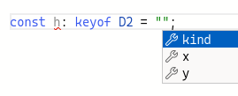
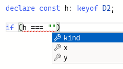

# keyof

`keyof` is the *Index Type Query*.
From the docs:

> An indexed type query `keyof T`  yields the type of permitted property names for `T`.
> A `keyof T` type is considered a subtype of `string`.

The `keyof` operator takes an object type and produces a string or numeric literal union of its keys.

### keyof D2 example

```typescript
type D2 = {
  kind: "2D";
  x: number;
  y: number;
}

const h: keyof D2 = "‽";
```

What types and values could be assigned to `h`?

In the first place, `keyof D2` produces a string union of the keys in `D2` in this case because the type `D2` defines an object with three properties, and object properties are strings.
So, the `h` requires strings.
But not *any* string in the set of all possible strings.
It has to be one of `"kind" | "x" | "y"` because “keyof produces a string union of an object's keys.”
Therefore, those are the only thee possible values we can assign to `h`.

Intellisense works as expected:





- [TS Playground 2D/3D example](https://www.typescriptlang.org/play?#code/PTBQIAkIgIIQQVwC4AsD2AnAXBAYgU3QDsBDQgE1QgCFiBnW1cYaCZRRAB1sxADMCS5VACM6DAHRk8AN2ABjVIUTE5iMJBhtO3PgNIVR9VOIDmAS0QAbYsPFnUwKdLQB3RA6YstXHsBf-JGVd3QNkmTwBrPABPVF4IRGiOPAhUZPRid3RPAF48-ILCgvDQMwBbDgxEBKSUgG8IAFEAR3hiSwAaJoAPZNUIAF8IXnRUMogAIgABROSAWjlkdss8QhM8WmAkM0taCYBuUCPZlIARACYIHIg60AgICLNybAnz04O7iG7sQngy4QIh3u0R+fwB6EOA2OtQgpwAzFcbp9Hs9JnD3vsIJ9vhBfv9AZ8QbiwQT7gAvUH4iGgAaHI4KQi0apkc7YKKxeIXRETAA8iHQZhM63QECeiDwlksZloqxlrAIeAAfB9QAymRAyHC2TE4rCEddefzBcLRUoJVKZYyUsgFcq6SBPAAVdDRCCLUjmNYQQAYBGTvRAXBZkD7ot6uhgfSiyIBMAnEEEdNsICRdWMg3oi0dSIu9hDSeEz+lNtD61RQKQIo3Q4nCauqyG1HL13IiKpOsPOAGkYrREezdRdDm34V3oj3rn3OXC6W3HRtEABhOgbREAbU+jV6eFUPJabUsPIn7a6EyjEwgAB9Jt0z5eJtEJorFR115vt7v2jyLiPaMfTxerzekz3o+z4viWO6tB+h7wr+TxkIBEzXv+d4IWSD5PmBW6IBBe6fnC36weQCFIbe97IWhIGgAAuocQA).

### keyof D3 example index signature

Suppose this type is in context:

```typescript
type D3 = {
  kind: "3D"; 
  x: number;
  y: number;
  z: number;
};
```

Consider:

```typescript
declare const shape3d: D3;

let k1 = "x";

//
//      k1 indexing errors 😭
//      ---------------------
//                  \
//                   \
//                    v
const val1 = shape3d[k1];
//
// ERROR:
//
// Element implicitly has an 'any' type because expression of type
// 'string' can't be used to index type 'D3'.
//
// No index signature with a parameter of type 'string' was
// found on type 'D3'.
//
```

`k1` is assigned `"x"`, but it could have been changed since its assignment and
its use.
After all, it is a string declared with `let` (`var` would have produced the same outcome), not `const`.

`k1` is of type `string`, not the union of literal strings `"kind" | "x" | "y" | "z"`, and TypeScript knows those are the only four possible keys in `shape3d`.

It works though if we use *const context* when declaring the variable:

```typescript
declare const shape3d: D3;

var k2 = "x" as const;
let k3 = "x" as const;
const k4 = "x";

const val2 = shape3d[k2];
const val3 = shape3d[k3];
const val4 = shape3d[k4];
```

All of the above work as expected, correctly indexing the property `x` of the object.

- [TS Playground with D3 const context example](https://www.typescriptlang.org/play?#code/PTBQIAkIgIIQQVwC4AsD2AnAXBAYgU3QDsBDQgE1QgCFiBnW1cYaCZRRAB1sxADMCS5VACM6DAHRk8AN2ABjVIUTE5iMJBhtO3EAHd9kmWl2JUh2UyYQA1ngCeqXhER2OeCKjfpip9FYC8gUHBIcGWoC5uEAAiAMwQ-hAA3qAQNgCW5NgARLHR2QDcEKkQAB7YhPAAtsIEBSV2FdW16PVpAF5NNXWgAL71oKBScgA2xOjuCoS0iBC0yMRusWTYcQMjeLPWAIwJENmlhVYQAHoA-IOg0uM2AEx7B9kQdBBTM-WQpxegG1vxiY9nrRXop3sdzoM3lsACwPQ4fZhpL6Q0Gza4jXaJeaLPDLADaOwAugikcjQFCIOj7liFksyATbsTjmkIeTUZTiCN-nNabj6dZYkzPizvhT0bCaTj8dZoULESLQEA)

## keyof with getProp() function

Here's function that takes an prop name and an object, and we return the value of that prop.
We use `typeof` to help us limit the name of possible keys based on the object passed.

```typescript
type Jedi = {
  name: string;
  skills: string[];
  points: number;
};

function getProp<
  ObjType,
  Prop extends keyof ObjType,
>(propName: Prop, obj: ObjType): ObjType[Prop] {
  return obj[propName];
}

declare const luke: Jedi;

getProp("point", luke);
//
// ERROR:
//
// Argument of type '"point"' is not assignable to parameter
// of type 'keyof Jedi'.
////

getProp<Jedi, keyof Jedi>("points", luke);
//
// OK because ‘points’ is a key in the type ‘Jedi’.
////
```

Note how we use `Prop extends keyof ObjType` as the second generic type parameter in the definition of `getProp()` and then the parameter `propName` annotated with that type `Prop`.
It causes the type checker to only allow property names that actually exist in the type `ObjType`, which in our example is bound to the type `Jedi`.

- [TS Playground for getProp() with keyof in prop name type](https://www.typescriptlang.org/play?#code/PTBQIAkIgIIQQVwC4AsD2AnAXBAYgU3QDsBDQgE1QgCFiBnW1cYaCZRRAB1sxADMCS5VACM6DAHRk8AN2ABjVIUTE5iMJBhtO3EAHd9kmWl2JUh2U1ChEATw54IAKTxkAlhAC8EAN6gIEEgBbPGxaRHRXQgBzAG4-CFoAa1cAGxTuBPDIqIBtAF04-w5USMQMwnhA4QI4gF840F54QlVXRQgovEQABXRUDgAeeIB5YQArABU7PAAaeN7+iDwAD0Q8cloIRLwbVF4IUcnpuYA+AAoOPo4AOWJg7AWOGYgRMexDqfsASnfxz7wco88j54uguvAiC9xjlLv1bsECqBalZQFI5CliGCIApCGEICl4NtsM43A1Oj0rmcAETFUpU54E7ZfOIgJgQACiACVOcNOZhLJBYOgopV1ogXvtbPYIAByGklJRUmUQVybQiocViVxREjCFIOUwQDiYu5dAhsvYQKUOGXbXb7EmuGXiSygcmPAaO552y2O85UgZZKKddAqpR4NKq9a0BzIAh4E70-GEvDMqwgDOZrPZnO5vP5guF9TMCZ4PEAYToZbZAFo6-WG5ZXIFiuhxdafByAI7wYgpZ7s5b2VQQWoQXh9QIQKkAAWtNbkyD7+uiZeASFStCpDRxeMZeHhDi87spVKCeCT+7Tu-F+4Aysk0ptj11HtSkql0peU9fFHuU90CplJ4HSvqetJKFuDI-g0HZyFWz4QDk8SDsOiADOyPZ9oG0yWvuh7PGEETRCcJxzP4qF4KoGFYSkOH2HhKYPp+tCEVk0T5KR5EckOVHoZhvZ0dajHbIBpSsQElTVOgXGgIiQA).

## keyof in type predicates

In this next example, we have a function that displays a prop from an object, but its parameter types are very permissive:

```typescript
function displayObjProp(
  prop: string | number | symbol,
  obj: Record<string, unknown>,
): void;
```

Note that `prop` is `string | number | symbol`.
Those are the ways we can index the keys of an object in JavaScript, so, TypeScript has to consider them all when indexing object types.

And then we turn our attention to the implementation of `displayObjProp()` in combination with `getProp()`:

```typescript
function getProp<
  Obj,
  Prop extends keyof Obj,
>(
  propName: Prop,
  obj: Obj,
): Obj[Prop] {
  return obj[propName];
}

function displayObjProp(
  prop: string | number | symbol,
  obj: Record<string, unknown>,
): void {
  log(getProp(prop, obj));
  //           ^
  //          /
  //         /
  //      ERROR 😭
  //
  // Argument of type 'string | number | symbol' is not assignable
  // to parameter of type 'string'.
  // Type 'number' is not assignable to type 'string'.
  //
}
```

`getProp()` requires more specific types, but the type of  `prop` in `displayObjProp()` is too generic.

- [TS Playground incompatible getProp() types](https://www.typescriptlang.org/play?#code/PTBQIAkIgIIQQVwC4AsD2AnAXBAYgU3QDsBDQgE1QgCFiBnW1cYaCZRRAB1sxADMCS5VACM6DAHRk8AN2ABjVIUTE5iMJBhtO3PgNIVR9VOIDmAS0QAbYsPFnUwKdLQB3RA6YstXHsBf-JGVd3QNkmUFAFQlpECEtUE2wAYUUGSzwAbQAieJMsgF0IAF4IKLS8cVzxYTNyAAoy1HSASgBuCN54QlV7QggTPEQABXRUDgAeUAgIAHlhACsAGimIEbGIPAAPRDxyWggAazwAT1ReWYXlgD46lY5RjgA5YgBbPGw1jmXpkXnsOaWoGa-wWGU+hQA3it0IN4EQIL8Mvcxs83vl2gBfDpdHqKCBkMy0DjWY4Az63abIjjYGLoWomCAAHwghHgL2EBCZEFox3ZTW+CIW2AASngFOgyONafTFhAugdCKgXIQrstgRBpKgzGQIFDprk6gNhg86lTZb9mm0VpBpra7RAAHrW5j2u1gaY210Qd3el12gCiwuFM2FzudcHQJjZu1iZwgiGOHDwEAA5NLCAzmaz2ZzmTy+ZYUxBCSzULExGYTCRhOlw+4IBxiOhXoNOXGE0nU+mTCnxOGACqJ5Mp7Mc9BFkuK8v0SvV9Lxygd4fd3thrFAA).

But we can create a type predicate to make sure the prop really exists in the object.

```typescript
/**
 * Type predicate to check whether `key` exists in `obj`.
 */
function isKey<Obj>(
  key: string | symbol | number,
  obj: Obj,
): key is keyof Obj {
  return key in obj;
```

Note the use of `keyof` in the predicate return type!

We can make use of this type predicate (a.k.a type guard) inside `displayObjProp()` to make sure we only call `getProp()` if we know the object is sure to contain the given key:

```typescript
const log: Console["log"] = console.log.bind(console);

type Jedi = {
  name: string;
  skills: string[];
  points: number;
};

/**
 * Type predicate to check whether `key` exists in `obj`.
 */
function isKey<Obj>(
  key: string | symbol | number,
  obj: Obj,
): key is keyof Obj {
  return key in obj;
}

/**
 * Returns the value of the property `propName` from `obj`.
 */
function getProp<
  Obj,
  Prop extends keyof Obj,
>(
  propName: Prop,
  obj: Obj,
): Obj[Prop] {
  return obj[propName];
}

/**
 * Displays the value of a property.
 * 
 * **NOTE**: This is a dummy, convoluted and simple example so
 * we can focus on the types.
 */
function displayObjProp(
  prop: string | number | symbol,
  obj: Record<string, unknown>,
): void {
  if (!isKey(prop, obj)) return;

  log(getProp(prop, obj));
}

const luke: Jedi = {
  name: "Luke Skywalker",
  skills: ["The Force", "Lightsaber"],
  points: 97,
};

displayObjProp("z", { x: 1, y: 2 });
//
// Prints nothing.
////

displayObjProp("name", luke);
//
// → "Luke Skywalker".
////
```

[TS Playground isKey() type predicate](https://www.typescriptlang.org/play?ssl=67&ssc=4&pln=7&pc=1#code/PTBQIAkIgIIQQVwC4AsD2AnAXBAYgU3QDsBDQgE1QgCFiBnW1cYaCZRRAB1sxADMCS5VACM6DAHRk8AN2ABjVIUTE5iMJBhtO3EAHd9kmWl2JUh2U1CgFhWoggAbVAHNsAYUUMHeANoAiJ2c-AF0IAF4IGy88cUDxYQBLcgAKKNRvAEoAbitEAE8OPAgAKTwyBPCIAG9QCAgSAFs8bDt0JOccutoAawSHB24IVvafYM6IDlQkxEHCeAbhAhyAXxzwACp12vWIABUCoo50MoS5YkQi00jkPDluiF0blAIIAANuvDzXiDwADwS7LQIEk3iIAFavcTbMC8eCEVQJRTA2gAaU+AB4APLCMEAPmStQgHzyLUQbUIzggAB8hnkFulqfV5ot0AAaQng7DYsHsjLYYnIomfVC8CDc6qE46IeBEIV5YGECDglZWYCbbYQABKeGlRCBzwg0mIDngRRFEANR1QhXQ+TeVo4ADliE1vrx0KgGqCcZDoaBYfDEIjFc4dQAFD0cdGE7nsuoR60-X4XchA4nm2OgfGEh3OprYBMcONKnFcnG8stgnyF0I1OpSmWK8E+XMuvBjUDLVXqiA7AAiAI4DmIeX1N0NxtNStFxAmkYI+ShvYgGs2jsxuwAoptsLtkADBbOyPMGnlWZFFNJ0kgyhBSGQhgkGkOin8XS+hoxl7oimdFbxUDkeAgSRA18kKWgl3WGE4QRJFyloIcR25QsCTqB1SXJSkaTmBYXhpWg6WEdJi05LVbgwMh0WGClzzhbpCFQXRCFxCtDSmB862BUVkgAQgBNE8mSB1z3BDIMggBsiDWOpAmSUNEFQkSSzBcSVWsTx7BND5sFKcpKi4xpmggPwABl4A+CAAGVujyXRjQ+dA-GLHo+gGbB-D3IocAwOQ8GckzTISZw2FoYgWRCYtJmmQYAE4AHZ2VWKwEKQvIUMjZI-AALwCqoIF+bAAEZzxJCAACYIGWbJLEgCMYvqVAUHaKEQBAFLB2HdKcVQvwjIC7S8Bq9rIEAJMJAosoobLshyCD8Vq2tAIA).

## keyof with mapped types

`keyof` is also useful to map over types and iterate over its keys.

### Partial type utility

```typescript
type Jedi = {
  name: string;
  skills: string[];
  points: number;
};

type MyPartial<Obj> = {
  [Key in keyof Obj]?: Obj[Key];
  //                ^
  //               /
  //              /
  // Note the use of ‘?’ to cause each mapped property
  // to be made optional.
  //
};

type JediOptionalProps = MyPartial<Jedi>;

const yoda: Jedi = {
  name: "Yoda",
  skills: ["The Force", "Teaching", "Lightsaber"],
  points: 100,
};

const luke: JediOptionalProps = {
  name: "Luke Skywalker",
  //
  // Type is valid, even if we don't provide skills and points.
  //
};

//
// Even empty object satisfies the type.
//
const other: JediOptionalProps = {}
```

Try commenting out `yoda` properties to see how it really requires all three properties, while with `luke` has all of them optional.

- [TS Playground Partial type utility with keyof and mapped types example]().

### Required type utility

In this case we start with a type where each property is optional, and create a type where all of them become required:

```typescript
//
// Note all properties are optional.
//
type Jedi = {
  name?: string;
  skills?: string[];
  points?: number;
};

/**
 * A type utility to make all properties in `Obj` required.
 */
type MyRequired<Obj> = {
  [Key in keyof Obj]-?:Obj[Key];
  //                ^
  //               /
  //              /
  // Note we do not have a “?” between “]” and “:”.
  //
};

type JediRequiredProps = Required<Jedi>;

const yoda: JediRequiredProps = {
  name: "Yoda",
  // skills: ["The Force", "Teaching", "Lightsaber"],
  points: 100,
};
//
// Property 'skills' is missing in type '{ name: string; points: number; }'
// but required in type 'Required<Jedi>'
///
```

Uncomment `skills` above and see the type checker is then appeased 🤣.

- [TS Playground key of with mapped types Required type utility example](https://www.typescriptlang.org/play?#code/PTBQIAkIgIIQQVwC4AsD2AnAXBAYgU3QDsBDQgE1QgCFiBnW1cYaCZRRAB1sxADMCS5VACM6DAHRk8AN2ABjVIUTE5iMJBhtO3EAHd9kmWl2JUh2U0uQA1ngCeqXhACWhCAAVi6RM+IAbCCRnP2dEOwgwjjwmCABeeITEpOSU2MtQBUJaRAg-VABzbABhRQY-PABtACI8-KqAXTiITLK8cVrxYVcyAAoW1HKASgBuUCtmADlURDwIfwCOdFQo72c8Wjn0WeWfRX9xS0jZgCk8MmcmgG9QCAgSAFs8AH5sbPRXfNHb2mtgv1oXhA3h8KvUvhAOKhXIgAdhCPB7sICKMAL6jcAAKgxNwxcAidiigR8ITCEUo92ItjmfgWSxWPnWLjcAAMAPLCABWzIgWwAjvBnFsyAcIBiwEcIABZOwAJTw-MFZwAPOyOQA+K43CAVADS9iZEFsDicqvqAFpAardfYwVrILcHY6nRAAHp25jOz0QMC3e1ex0+72TaazFDEHK6WbwWizQAYBBbAJgEABoILpkM45MgXBsULNaHYlMQAB5knl4e6oaTRX3MUgQHbOPYBcOId7CJCzXhLe5zCF0ghhEVB0BosYS07nOUKoXuOkbWIQKcCoVKifONXolo5BxkYjYNdLxVkWfLecQa63B54bBVACaqF3VST7qBvxp3G1VQAKshZjgMHIeBPhA354Co6aEHUKZVAAMs4+RsLQxBIugDTPrckLQh+ACMAAMuHPqOIAxCe9LhAA5D8fy0OR2YQPczj0B8BoSuRlx3MQjyvK2HzDBCUJKB+8KIsiEAouRMTtjkfLLmcLEErM5GHiua5qhJIDEWMzj3JC3j4oS7EAKL8v4KaGUWUSqGJEBdqgPZVAAAkcZqZvMeCQeswBBP8VTohKX7rIgRR0IyC4VFq5mWYgSrGfA-hKtKynKge8qycec5qimF4Ole3HvJB6EOlR755SC9SFRhAkwnCCIoYVKJqmqoBgkAA).

Strictly speaking, in my tests, it seems we don't actually need `-?` to remove the optional attribute from a property; just not using `?` altogether seems to suffices.
Still, being explicit makes it evident about what is going on.

## References

- [keyof type operator on the TypeScript Handbook](https://www.typescriptlang.org/docs/handbook/2/keyof-types.html).
- [Mapped Types on the TypeScript Handbook](https://www.typescriptlang.org/docs/handbook/2/mapped-types.html).
