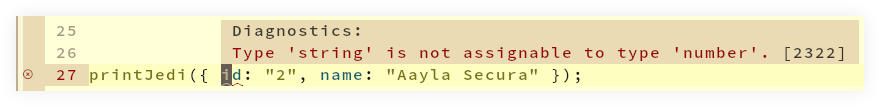
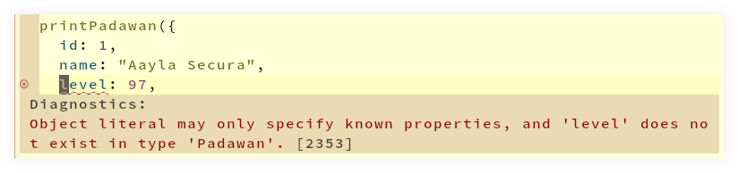
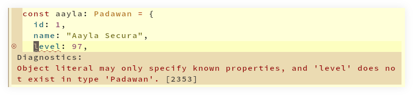

# Structural Typing

## Introduction

TypeScript implements a _structural_ type system.
It means the names of types don’t mater.
Only their shapes do.

For example, here’s a type and a function that takes that type as parameter:

```typescript
type Jedi = {
  id: number;
  name: string;
};

function printJedi(jedi: Jedi): void {
  log(jedi.id, jedi.name);
}

const ahsoka: Jedi = { id: 1, name: "Ahsoka Tano" };

// ①
printJedi(ahsoka);

// ②
printJedi({ id: 2, name: "Aayla Secura" });

```

1. Type-checks because `ahsoka` is of type `Jedi`.
2. Type-checks because even though we didn’t explicitly create the object for Aayla by annotating it with the type `Jedi`, the type checker is satisfied with the the structure of the passed object.
Because it contains `id` of type `number`, and `name` of type `string`, the type checker is happy with it.

But as soon as the shape doesn’t match, the type checker catches it:

 

## Type compatibility

Consider:

```typescript
type Jedi = {
  id: number;
  name: string;
  level: number;
};

type Padawan = {
  id: number;
  name: string;
};

function printPadawan(padawan: Padawan): void {
  log(padawan.id, padawan.name);
}

const aayla: Jedi = {
  id: 1,
  name: "Aayla Secura",
  level: 97,
};

//
// Type-checks just fine.
//
printPadawan(aayla);
```

The function was declared to take a parameter of type `Padawan`.
When called, it was passed an argument of type `Jedi`.
Because `Jedi` has all the properties that `Padawan` has, the type checker is satisfied with it.
Inside the function body, as long as value provided contains the `id` and `name` properties, it doesn’t matter if it also contains other, extra properties.

This is one example where the fact that the names of types don’t matter (only their shapes do) can be observed.

### Excess property checks

In the previous example, we first declared a variable and _then_ passed it to `printPadawan()`.
However, if an object with extra properties is provided as an object literal, directly to the function, then the type checker will complain.

```typescript
printPadawan({
  id: 1,
  name: "Aayla Secura",
  level: 97,
  // ~ Object literal may only specify known properties, and
  // ~ 'level' does not exist in type 'Padawan'.
});
```



Similar if we do this:

```typescript
const aayla: Padawan = {
  id: 1,
  name: "Aayla Secura",
  level: 97,
  // ~ Object literal may only specify known properties, and
  // ~ 'level' does not exist in type 'Padawan'.
};
```



If we already have an object declared elsewhere and it contains extra properties, the type checker allows the extra properties.

However, if one tries to pass extra properties at the moment of assignment, then the type checker thinks “why the poop they are doing this‽”, and complains about it.
This _excess property check_ feature was implemented to guard against cases one expects properties to be present and wonder why changing them wouldn’t have any effect.
