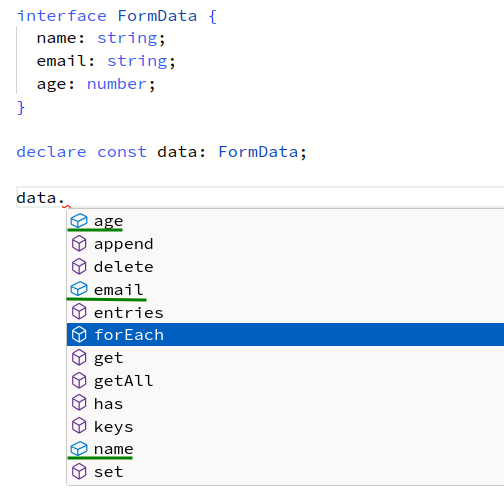

# Type Aliases and Interfaces

## Introduction

In the beginning, types aliases were quite different from interfaces.

Over the years, forum discussions and posts would happen from time to time about the differences, pros and cons of each one.
As new versions of TypeScript would be released, those posts and pieces of advice would become outdated.

As of TypeScript 4 (maybe earlier), there is not much difference between interfaces and type aliases.
What you can do with one, you can do with the other (albeit with different approaches).

The main difference as of TypeScript 5.x is that interfaces allow for _declaration merging_.

## Example Interface vs Type Alias

```typescript
interface IPerson {
  id: number;
  name: string;
};

//                 <1>
interface IStudent extends IPerson {
  email: string;
}

const student1: IStudent = {
  id: 1,
  name: "Aayla Secura",
  email: "aayla@jedischool.dev",
};

type TPerson = {
  id: number;
  name: string;
};

//                     <2>
type TStudent = TPerson & { email: string };

const student2: TStudent = {
  id: 2,
  name: "Ahsoka Tano",
  email: "ahsoka@jedischool.dev",
};
```

1. Using `extends` to create another interface from a base interface.
2. Using the intersection operator `&` to compose together the two types.

:::{note}
The intersection behaves more like an union operation this example.
Read more on [Intersection Types](./intersection-types.md) and [Union Types](./union-types.md).
:::

* [TypeScript Playground: Type Alias and Interface example,window=_blank](https://www.typescriptlang.org/play?removeComments=true&jsx=0&module=1&pretty=true&preserveWatchOutput=false&inlineSourceMap=false#code/PTBQIAkIgIIQQVwC4AsD2AnAXBAYgU3QDsBDQgE1QgCFiBnW1cYaCZRRAB1sxADMCS5VACM6DAHRk8AN2ABjVIUTE5iMCFCgAFL3iFVAS0UQtASggBvUBAjTi6CIgOIANnggBeCACIAKgE8Od1gXAzo8WghSMggASSUCXhUIiExsAKCAZTl0Aw5EbwBuawgKOXgAWzwlcSdXdy86t2KAXzNTYqYmOMJHZANIvAAPYgqONwgAd3ccvGJEdxR3WlHFwPd4WgNCAHMIYVQUbtIIbYX0JLl3aKjHdajQunEIX2R3apj0CPgXRG6BvrLVbiLqgM6JZJxAAKBAYvSsNgMZGwhEqwgIxRsJCq2FoiFyu1anXBF0hsUyiHgUiUEGGC3IkViMPQcMsJTwFWIBhcuPx2x2rU0CkIeIgeKp1UQAEZsOTKdTEJ42YjkRApQAaErYvDYbywYj+FzECCZPDldDEbyamwcrk8nzEA1GgACACs8GQBnI0KgXJIZFbQC1Ooh7r5mayvAjTqrURV0ehMRBtbyCQKg50NJB4ni5jFULwIAADOkfWhFqYbWiLN6nBIss1OYyoIIWxAYCAAMhBGlDQReFIlNK84dhxk7llpnO5qf5EGDQsUovFCoATOlBwqldGkdhV9bk6tdbBkAwANbG3ykVCBm3T+3eYin1AXt0er0+v1SaSBhegIA).

## Interface Declaration Merging

Interfaces allow for the so called _declaration merging_.
It means an interface can be _reopen_ and new things can be added to it.

```typescript
interface Page {
  title: string;
  url: string;
}

interface Page {
  locale: "es_MX" | "hi_IN" | "pt_BR";
}
```

The above is same as if we had done this instead:

```typescript

interface Page {
  title: string;
  url: string;
  locale: "es_MX" | "hi_IN" | "pt_BR";
}
```

- [TS Playground: Declaration Merge Page Interface Example](https://www.typescriptlang.org/play?removeComments=true&jsx=0&module=1&pretty=true&preserveWatchOutput=false&inlineSourceMap=false#code/PTBQIAkIgIIQQVwC4AsD2AnAXBAYgU3QDsBDQgE1QgCFiBnW1cYaCZRRAB1sxADMCS5VACM6DAHRk8AN2ABjVIUTE5iMCFBMmEAKJkAloggo8xwwBtTpMhHTxCERXNOJKtPEZMQOxAOYuLPG1hPF4MU2FUVABrAFtidGj9Ql9xLQAKXntVfUUIdIBKCABvUAgIaQSzREsIAF4IACIAETw5cwTiRFyHAFkCX2TfCAAFP1MASSUCXhVTHQAPYliOWsxsABUATw48AGU5dH0OREaAbjKICjl4WLwlcW6a0wanywuAX0KCi9BkxBmc1G4xKlzeeGwtEQRxSF3K8HQ5kh0KGn00-0BzmB-lB5XMqDkxEs2EaeFoAH1egANRoQAA+TWQ+nJEwAcrSGY0TuSqAAlc6gD6aKTtBKmBSEKHecbYMb+X4aSDbDhDCCAHAIfP5xIBcAggtDQ8HMNiJ+IA7rY8MQDClgKajuxVV4OOhULt0N0ydpABgE4MAmAQAGggXoR5l9EGsQfxhMsvrSGiAA).

It is useful feature for when we need to _augment_ an interface defined elsewhere outside our control (maybe from a library or a global type like `Window`):

```typescript
////
// Augments Window interface by opening it and adding information
// about analytics.fireEvent().
//
interface Window {
  analytics: {
    fireEvent: (name: string, payload: unknown) => void;
  };
}

////
// Possible to call analytics.fireEvent() because we augmented the
// Window interface using declaration merging and made it aware
// that there is this new analytics object which provides this
// fireEvent() method.
//
window.analytics.fireEvent("user-click", { id: 1, name: "Jon Doe" });

////
// Other things not part of the default Window interface and not
// added to the types in some for is not legal.
//
window.datalayer.fireEvent("user-click", { id: 1 });
//     ~~~~~~~~
//         \
//          \
//           +---> Type error. Window knows nothing
//                 about this datalayer thing. Thus,
//                 it doesn't type check.
////
```

- [TS Playground: Declaration Merge Window Interface Example](https://www.typescriptlang.org/play?removeComments=true&jsx=0&module=1&pretty=true&preserveWatchOutput=false&inlineSourceMap=false#code/PTBQIAkIgIIQQVwC4AsD2AnAXBAYgU3QDsBDQgE1QgCFiBnW1cYaCZRRAB1sxADMCS5VACM6DAHRk8AN2ABjVIUTE5iMCFBMmEAKJkAloggo8xwwBtTpMhHTxCERXNOJKtPEZMQOxAOYuLPG1hPF4MU2FUVABrAFtidGj9Ql9xLQAKXntVfUUIdIBKCABvUAgIaQSzREsIAF4IACIAETw5cwTiRFyHAFkCX2TfCAB1ZIoAdwgASSUCXhVTHQAPYliOWsxsABUATw48AGU5dH0OREaAbjKICjl4WLwlcW6a0wbXy2uAX0KC66YGkgCF8jyUtFG41QU2SiHmiwgwl2jgOhCGEEMEGsWLIBhSGMIYXQ8W6im0xEiSCxJHMu26clo4l4+nQeB00ieiEKaQ0sPhzkhQimpXKpGItPp3BKN3KzNZ7M52HSJEe2FoiFOKQANN5iLtzKhiGRsPZooRoYQinUAHwVVD6MjXcrfH6aEBA5gABVQ9H0wlqrggcnF5mp4rp+gZTJZbI5SkKiLaxHg7ggEys8FBnLwNhM2jGQoJcPQCwFKfRUnanVJDke6EG+Ox8SkGKMxAmCSCkBQXWMyAIpn0EJQQ4ghDwUzFEsjEJEACs2kYJshI8hvOhUNIHXhhyvaNo5bHOQnHihUGQeWAJlCJuIpxGo4eFfHGimCABadqR6KNHXFDHGhAACMOoqng2CNAAUnkzSoHgjQQN8-xuu62gAPImOgfZDBC5pGD46BGKgvB9qYUgLPA5hGAWkxFvyVjkGOqCIOSuI5sYlBeIg+w7gSEAMI8EBEhiuHMRAli+OKl6gNeQqSF04p6gQ0bynGXKvu46CfuY36-iUAHYEBiHIZA5TlAAfpZVmWdoZl2RAAA6tn2WZTmmS5ZkANTvj5tp7AcEAEBu6DiIKtFmtCokjikzkeR5FKoFSI4QmQCkdLsBDYSkoXbMgKZarFcX2ZiFA7oQADkng8UG-ZyNEl4gEAA).

## Declaration Merging Danger

One problem with declaration merging is that (at least currently, as of TypeScript 5.4.3), the type checker doesn't inform us when we are (maybe accidentally?) augmenting an interface.

Suppose we have a form to collect certain data and we want to represent its fields using an interface:

```typescript
interface FormData {
  name: string;
  email: string;
  age: number;
}

function sendData(data: FormData): void {
  ////
  // Seems to work fine and type-checks
  // but FAILS AT RUNTIME.
  //
  log(data.values());
  //
  // Where is .values() coming from‽
  ////
}
```

- [TS Playground Form Data Interface Merging Gotcha Example](https://www.typescriptlang.org/play?removeComments=true&jsx=0&module=1&pretty=true&preserveWatchOutput=false&inlineSourceMap=false#code/PTBQIAkIgIIQQVwC4AsD2AnAXBAYgU3QDsBDQgE1QgCFiBnW1cYaCZRRAB1sxADMCS5VACM6DAHRk8AN2ABjVIUTE5iMCFBMmEAKJkAloggo8xwwBtTpMhHTxCERXNOJKtPEZMQOxAOYuLPG1hPF4MU2FUVABrAFtidGj9Ql9xLQAKXntVfUUIdIBKCABvUAgIaQSzREsIAF4IACIcDFiAEWJlCABJJQJeFVMAWQJfZN8IAHFURDlkYl0AD2JYjlrMbAAVAE8OPABlOXR9DkRGgG4yiAo5eFi8JXFEQPrqy0uAX0KCy9AFQloRnMqF82AAwooGJYANqNYG+RoAXVe-yheHE8PEwmSZHSqNQlh+mhAGkgm2Q+loEEpEBUiHgxHM5m2jj2hHGxmQpjwi0pzxSEF8wNE5m0LXQ7U6C2SiH6g1p5FpZAMAti4W86FQe3QzzwtG0rmpiDSGhlcucuFaHS6pXKJHu2EBxxSl3KeHi+nMjsQzt8rtp-mwhDuIXQn00WUIOTy7nI1uI6TIUuw4slygK2GkqH0NltEBJYHKkH2eHdVMNAHcMNEILxklZFQpVp68AAaCDCJC4WDdAAy+yukFgmwgACUAKoAOU23SGOjSRcLEHhial4kq5ngeu+4aAA)



`name`, `email` and `age` are expected to be in a value of type `FormData`, but where are the other properties coming from?

Gotcha! Because there exists an interface called `FormData` in the DOM, we ended up **not** creating an interface named `FormData`, but actually _augmenting_ (performing interface merging) on the **existing** `FormData` interface.

And things get worse!
**It fails at runtime** as the value `data` actually only contains the properties `name`, `email` and `age`.

Had we used a _type alias_ instead, the problem would have been immediately apparent.The type checker would complain we were trying to redeclare an existing type with a message something like “Duplicate identifier 'FormData'.”

In short, it is a good idea to try to stick to type aliases for our own modules and things we control so we don't fall into the sort of problem just described, and use use interfaces when it is expected that other consumers will augment them through declaration merging (and only when augmenting through intersection don't seem like a good solution for a given problem).
